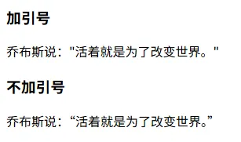
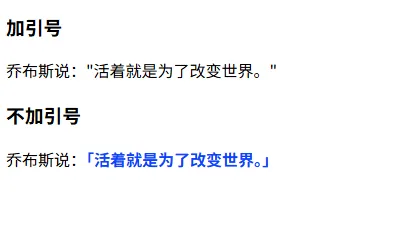
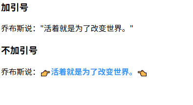

# q 标签

## 概述

+ 全称 quote 代表 短引用

## 对比

+ 一般加引号

  ```html
  <p>乔布斯说："活着就是为了改变世界。"</p>
  ```

+ 使用 `<q></q>` 标签

  ```js
  <p>乔布斯说：<q>活着就是为了改变世界。</q></p>
  ```

+ 对比一下效果:不仅不用手动写引号，还能根据语言环境智能区分单双引号

  ```html
  <body>
    <h3>加引号</h3>
    <p>乔布斯说："活着就是为了改变世界。"</p>
    <h3>不加引号</h3>
    <p>乔布斯说：<q>活着就是为了改变世界。</q></p>
  </body>
  ```

  

## 美化

+ 可以通过css样式来美化一下

  ```css
  // 设置中文引号样式 + 颜色加粗
  q {
    quotes: "「" "」";
    color: #1343fa;
    font-weight: bold;
  }
  ```

  

+ 添加动画

  ```js
  q {
    quotes: "👉""👈";
    color: #3594f7;
    font-weight: bold;
  }
  q::before {
    display: inline-block;
  }
  q::after {
    display: inline-block;
  }

  q:hover::before {
    animation: poke-back 0.6s ease-in-out infinite;
  }
  q:hover::after {
    animation: poke-forward 0.6s ease-in-out infinite;
    animation-delay: 0.3s;
  }

  @keyframes poke-back {
    0%, 100% {
      transform: translateX(0);
    }
    50% {
      transform: translateX(-3px);
    }
  }
  @keyframes poke-forward {
    0%, 100% {
      transform: translateX(0);
    }
    50% {
      transform: translateX(3px);
    }
  }
  ```

  
