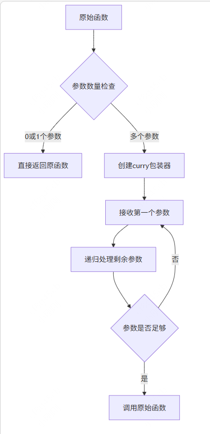

# curry 柯里化

## 概述

+ 将一个函数柯里化，允许它每次只用一个参数调用，并返回一个接受下一个参数的新函数
+ 这个过程会继续，直到所有参数都已提供，此时将使用所有累积的参数调用原始函数

## API

+ API

  ```js
  function curry<R>(func: () => R): () => R;
  function curry<P, R>(func: (p: P) => R): (p: P) => R;
  function curry<P1, P2, R>(func: (p1: P1, p2: P2) => R): (p1: P1) => (p2: P2) => R;
  function curry<P1, P2, P3, R>(func: (p1: P1, p2: P2, p3: P3) => R): (p1: P1) => (p2: P2) => (p3: P3) => R;
  function curry<P1, P2, P3, P4, R>(
    func: (p1: P1, p2: P2, p3: P3, p4: P4) => R
  ): (p1: P1) => (p2: P2) => (p3: P3) => (p4: P4) => R;
  function curry<P1, P2, P3, P4, P5, R>(
    func: (p1: P1, p2: P2, p3: P3, p4: P4, p5: P5) => R
  ): (p1: P1) => (p2: P2) => (p3: P3) => (p4: P4) => (p5: P5) => R;
  function curry(func: (...args: any[]) => any): (...args: any[]) => any;
  ```

+ 参数

  + func ((...args: any[]) => any): 要进行柯里化的函数

+ 返回值

  + ((...args: any[]) => any): 一个可以每次调用一个参数的柯里化函数

  ```js
  function sum(a: number, b: number, c: number) {
    return a + b + c;
  }

  const curriedSum = curry(sum);

  // 逐步应用参数
  const add10 = curriedSum(10);      // 返回接收b和c的函数
  const add25 = add10(15);           // 返回接收c的函数
  const result = add25(5);           // 返回最终结果: 30

  // 也可以一次性调用
  console.log(curriedSum(10)(15)(5)); // 同样输出: 30
  ```

    
