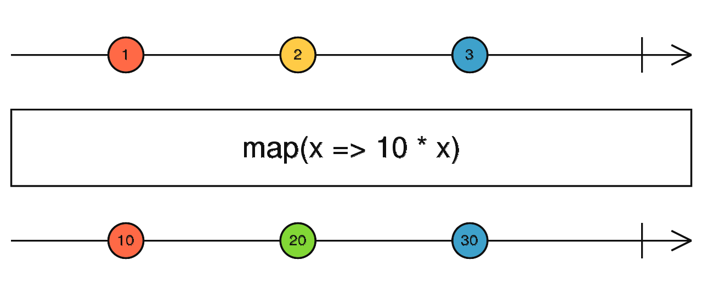

# map

## API

+ `map(project: (value: T, index: number) => R): OperatorFunction<T, R>`

  

+ 参数

  + project `(value: T, index: number) => R`

+ 返回值 `OperatorFunction<T, R>`

## 类型

+ 在TypeScript环境中，为map操作指定明确的类型，提高代码健壮性：

  ```js
  interface User {
    id: number;
    name: string;
  }

  // 明确指定输入输出类型
  userData$.pipe(
    map<User, string>(user => user.name.toUpperCase())
  );
  ```

## 避免在map中执行复杂逻辑

+ 保持map转换函数的简洁性，复杂逻辑应拆分为独立函数或使用其他操作符组合

  ```js
  // 不佳：map中包含复杂逻辑
  data$.pipe(
    map(item => {
      // 复杂的数据处理逻辑...
      return processedValue;
    })
  );

  // 更好：将复杂逻辑抽离为独立函数
  const processData = (item) => {
    // 复杂的数据处理逻辑...
    return processedValue;
  };

  data$.pipe(
    map(processData)
  );
  ```

## 最佳实践

+ 避免副作用:

  + map操作符应保持纯函数特性，避免在其中执行具有副作用的操作（如修改外部变量、发起API请求等）
  + 如有副作用需求，应使用tap操作符

+ 注意性能影响

  + 避免在map中执行过于繁重的计算，这会影响数据流处理的性能
  + 对于复杂计算，考虑使用debounceTime或throttleTime等操作符控制执行频率

+ 正确处理错误

  + map不会捕获转换函数中抛出的错误，需要使用catchError等操作符来处理可能的异常：

  ```js
  data$.pipe(
    map(item => {
      if (!item.valid) {
        throw new Error('Invalid item');
      }
      return item.value;
    }),
    catchError(error => of(null)) // 处理可能的错误
  );
  ```

## 示例

+ 示例 每次点击都映射到点击的位置clientX

  ```js
  import { fromEvent, map } from 'rxjs';

  const clicks = fromEvent<PointerEvent>(document, 'click');
  const positions = clicks.pipe(map(ev => ev.clientX));

  positions.subscribe(x => console.log(x));
  ```

+ 示例2

  ```js
  // 示例1：简单数值转换
  of(1, 2, 3).pipe(
    map(x => x * 2)
  ).subscribe(result => console.log(result));
  // 输出: 2, 4, 6
  ```

+ 事件处理与数据提取

  ```js
  // 从输入框事件中提取输入值
  inputEvent$.pipe(
    map(event => event.target.value)
  );
  ```
