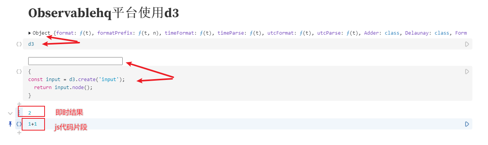

# 基本使用

## 安装

+ 方式1：本地引入 git下载：https://github.com/d3/d3/releases

  ```html
  <script src="../d3.js"></script>
  <script>
    console.log(d3);
  </script>
  ```

+ 方式2 cdn引入

  + 官网提供了多种cdn引入方式
  + 需要以模块化的方式使用
  + 不需要模块化方式的cdn引入地址：https://d3js.org/d3.v7.min.js

  ```html
  <script type="module">
    import * as d3 from "https://cdn.jsdelivr.net/npm/d3@7/+esm";

    console.log(d3);
  </script>
  ```

+ 方式3 npm

  ```
  npm i d3
  ```

+ 方式4 observablehq平台在线使用（该平台有自己的一些语法规范， 所以对于初学者，还需要先了解这些新语法）

  + 可视化在线学习平台

  + 类似于在线笔记本，可以云存储可视化作品，可以共享作品。

  + 编写js片段，并可以即时运行这些代码并查看结果

  + 集成了d3可视化库，可以直接使用d3

  
