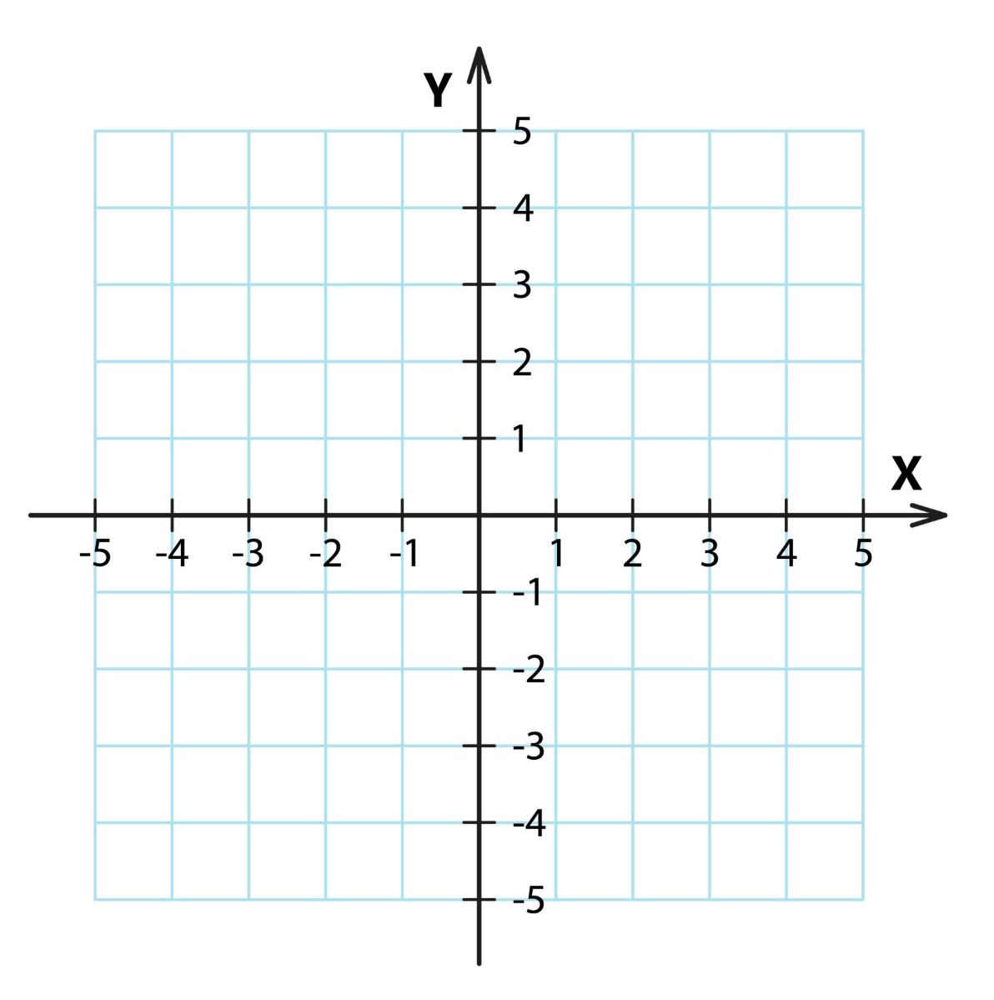
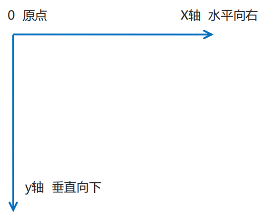

# 2D 变换

## 变换坐标系（笛卡尔坐标系）

+ 变换坐标系（笛卡尔坐标系）

  

## transform 坐标系

+ transform的坐标系，在笛卡尔坐标系这个基础上做了些改变，改变了Y轴的方向 从自下向上改为了向上向下

  

+ 左右变换基于这个坐标系 坐标的（0，0）点，相当于元素的中心，也是变换原点
+ 注意：在变换中一定要注意变换原点， 不同的变换原点，变换的效果是不一样的

