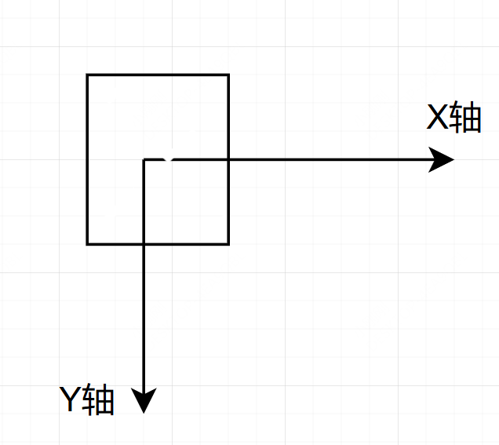

# 变换原点 transform-origin

## 概述

+ 默认中心点居于元素 x轴 和 y轴 50% 处

  

+ 值：`top`、`right`、`left`、`center`、`bottom`、百分比

## 语法

+ 1个值语法

  ```css
  transform-origin: 2px;
  transform-origin: bottom;
  ```

+ 2个值语法

  ```css
  transform-origin: 3cm 2px;

  transform-origin: left 2px;

  transform-origin: right top;

  transform-origin: top right;
  ```

+ 3个值语法

  ```css
  transform-origin: 2px 30% 10px;

  transform-origin: left 5px -3px;

  transform-origin: right bottom 2cm;

  transform-origin: bottom right 2cm;

+ 全局值

  ```css
  transform-origin: inherit;
  transform-origin: initial;
  transform-origin: unset;
  ```

+ 设置

  ```css
  transform-origin: top;
  ```

  ```css
  transform-origin: center;

  transform-origin: top left;

  transform-origin: 50px 50px;
  ```
