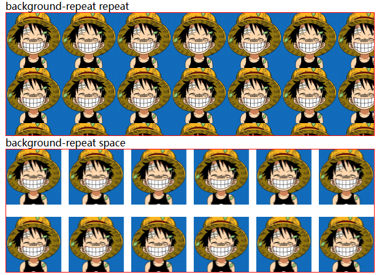
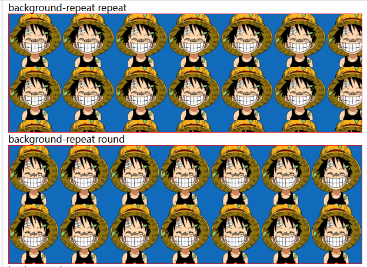

# background-repeat 重复方式

## 概述

+ 背景图像的重复方式
+ 背景图像可以沿着水平轴，垂直轴，两个轴重复，或者根本不重复

## 取值

+ repeat-x

  ```css
  /* x轴重复 */
  background-repeat: repeat-x;
  /* 等价于 */
  background-repeat: repeat no-repeat;
  ```

+ repeat-y

  ```css
  /* y轴重复 等价于 */
  background-repeat: repeat-y;
  /* 等价于 */
  background-repeat: no-repeat repeat;
  ```

+ repeat 重复

  ```css
  /* 重复 默认值 */
  background-repeat: repeat;
  /* 等价于 */
  background-repeat: repeat repeat;
  ```

+ space 均匀地分布， 均匀的显示设定大小（可能会留白），第一个和最后一个图像会被固定在元素的相应的边上

  ```css
  /* 会微调重复背景图片大小，使得背景图片尽量完整的显示 */
  background-repeat: space;
  /* 等价于 */
  background-repeat: space space;
  ```

  

+ round 缩放  尽可能的调整图片（没有空隙），使得可以容纳更多的图片

  ```css
  /*  */
  background-repeat: round;
  /* 等价于 */
  background-repeat: round round;
  ```

  

+ no-repeat

  ```css
  /* 不重复 */
  background-repeat: no-repeat;
  /* 等价于 */
  background-repeat: no-repeat no-repeat;
  ```

+ 双值语法：水平 horizontal | 垂直 vertical

  ```css
  background-repeat: repeat space;
  background-repeat: repeat repeat;
  background-repeat: round space;
  background-repeat: no-repeat round;
  ```
