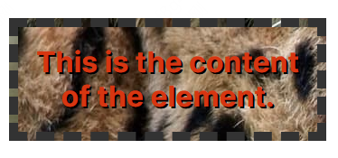
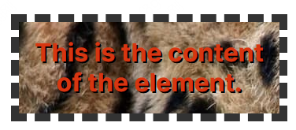
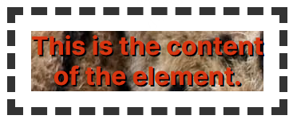
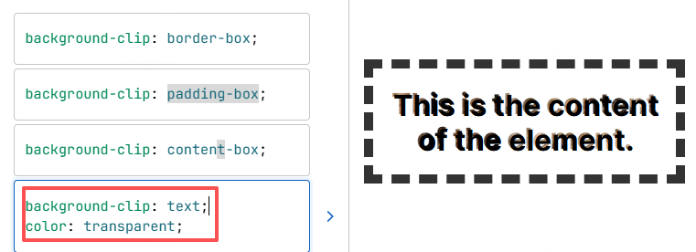

# 裁剪背景 background-clip

## 概述

+ 设置元素的背景（背景图片或颜色）是否延伸到边框、内边距盒子、内容盒子下面

## 语法

+ 取值

  + border-box 默认 背景延伸至边框外沿（但是在边框下层）

    

  + padding-box 背景延伸至内边距（padding）外沿。不会绘制到边框处

    

  + content-box 背景被裁剪至内容区（content box）外沿

    

  + text 背景被裁剪成文字的前景色

    

  ```css
  background-clip: border-box;

  background-clip: padding-box;

  background-clip: content-box;

  /* 同时设置文字为透明 */
  background-clip: text;
  color: transparent;

  /* 不裁剪 */
  background-clip: no-clip;
  ```
