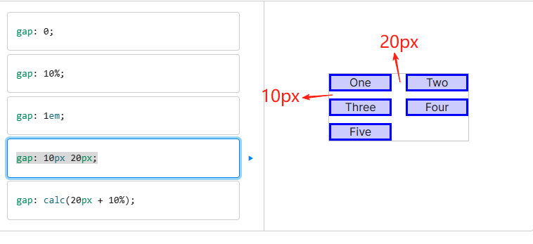

# 行列间隙gap

## 概述

+ CSS gap 简写属性用于设置行与列之间的间隙（网格间距）

+ 规范的早期版本将该属性命名为 grid-gap，且为了保持与旧网站的兼容性，浏览器仍然会接受 grid-gap 作为 gap 的别名

  ```css
  gap: 10px 20px;
  ```

  

## 组成属性

+ 该属性为以下 CSS 属性的简写：

  + column-gap
  + row-gap

  ```css
  /* 一个 <length> 值 */
  gap: 20px;
  gap: 1em;
  gap: 3vmin;
  gap: 0.5cm;

  /* 一个 <percentage> 值 */
  gap: 16%;
  gap: 100%;

  /* 两个 <length> 值 */
  gap: 20px 10px;
  gap: 1em 0.5em;
  gap: 3vmin 2vmax;
  gap: 0.5cm 2mm;

  /* 一个或两个 <percentage> 值 */
  gap: 16% 100%;
  gap: 21px 82%;

  /* calc() 值 */
  gap: calc(10% + 20px);
  gap: calc(20px + 10%) calc(10% - 5px);

  /* 全局值 */
  gap: inherit;
  gap: initial;
  gap: revert;
  gap: revert-layer;
  gap: unset;
  ```
