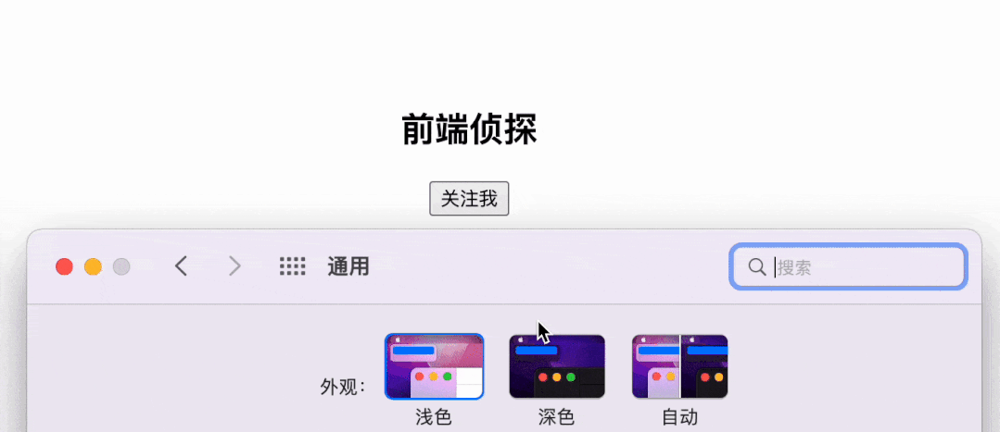

# color-scheme 和深色模式

## 概述

+ color-scheme 顾名思义，即为“配色方案”，在系统中指的是“白天模式”和“夜间模式”
+ 使用这个属性可以轻松的更改浏览器的默认配色方案

## API

+ API

  ```css
  color-scheme: normal;
  color-scheme: light;
  color-scheme: dark;
  color-scheme: light dark;
  ```

  + normal：表示元素未指定任何配色方案，因此应使用浏览器的默认配色方案呈现

  + light：表示可以使用操作系统亮色配色方案渲染元素

  + dark：表示可以使用操作系统深色配色方案渲染元素

## 实际使用

+ 在根元素上添加color-scheme属性

  ```js
  :root{
    color-scheme: light dark
  }
  ```

  
