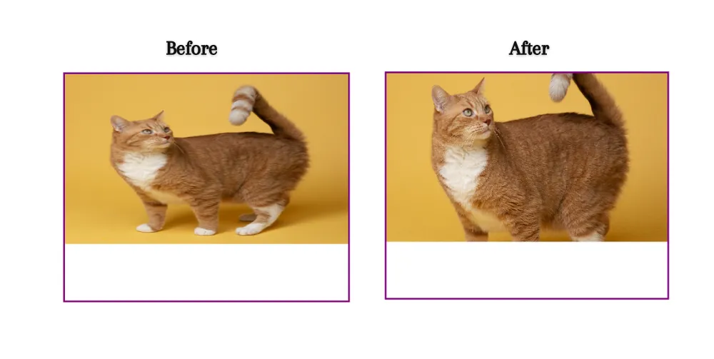

# object-fit

## 概述

+ 可以使用 object-fit 属性来设置图像或视频的大小调整行为，使其适应其容器

  

  ```js
  div {
    width: 500px;
    height: 400px;
    border: 3px solid purple;
  }

  img {
    width: 500px;
    height: 300px;
    object-fit: cover;
  }

  <div>
    
  </div>
  ```

## 语法

+ `object-fit` 属性用于控制替换元素（如 ``、`<video>` 或 `<iframe>`）在其容器中的尺寸调整行为
+ 通过设置 `object-fit` 属性，可以更好地控制替换元素在容器中的尺寸调整行为，确保它们能够正确地适应容器并保持比例

+ 当替换元素的尺寸与其容器不匹配时，浏览器默认会根据一定规则调整元素的大小和比例
+ 然而，这可能导致图像或视频失真，或者在容器中无法正确显示

+ object-fit 属性可以解决这个问题，它有以下几个取值

  + `fill` ：默认值，元素会被拉伸以填充容器，可能导致元素的宽高比发生变化，从而导致元素变形

  + `contain` ：元素会等比例缩放，保持其原始宽高比，并使其适应容器，不会超出容器边界，并且会在容器内居中显示

  + `cover` ：元素会等比例缩放，保持其原始宽高比，并将其放大到填充容器，可能会超出容器边界，但不会变形，并且会在容器内居中显示

  + `none` ：元素会保持其原始大小，不会进行任何尺寸调整

  + `scale-down` ：元素会根据容器的大小来确定是按原始大小显示还是进行缩小

