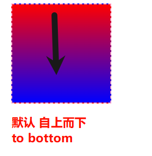
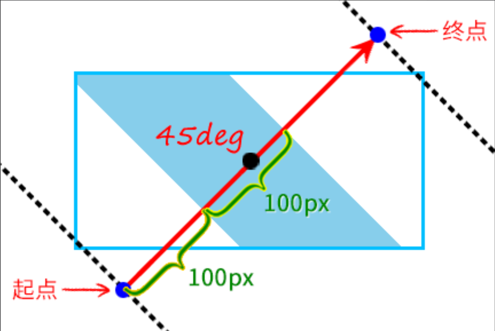

# 线性渐变 linear-gradient

## 语法

+ `linear-gradient(渐变方向，颜色1 变化区间，颜色2 变化区间，。。。,颜色n 变化区间 )`

  + 渐变方向： 关键字： to + 方向（top, bottom, right, left), to left , to top, to top left, to left top 角度： 50deg

    + 默认值：自上而下 `to bottom, 180deg`

      

    + `to top` 自下而上

  + 变化区间（渐变断点）：

    + 一个值: 作为颜色变化的边界
    + 两个值: 作为区间的开始以及终止 重复线性渐变：repeating-linear-gradient(); 注意：渐变区间的大小指的是在渐变方向的的小

  ```css
  element {
    background-image: linear-gradient(45deg, #fff 100px, skyblue 100px 200px, #fff 200px;
  }
  ```

  

## 示例

+ 示例1 默认值 自上而下 `to bottom, 180deg`

  ```html
  <style>
    .box {
      width: 200px;
      height: 200px;
      border: 2px dashed #fac;
      margin: 0 auto;
      background-image: linear-gradient(red, blue);
      /*
      相当于
      background-image: linear-gradient(to bottom,red, blue);
      */
    }
  </style>

  <div class="box"></div>
  ```

  

+ 示例2 自下而上

  ```html
  <style>
    .box {
      width: 200px;
      height: 200px;
      border: 2px dashed #fac;
      margin: 0 auto;
      background-image: linear-gradient(to top,red, blue);
    }
  </style>

  <div class="box"></div>
  ```

  

+ 示例3 右下到左上

  ```html
  <style>
    .box {
      width: 200px;
      height: 200px;
      border: 2px dashed #fac;
      margin: 0 auto;
      background-image: linear-gradient(to top left, red, blue);
    }
  </style>

  <div class="box"></div>
  ```

  


