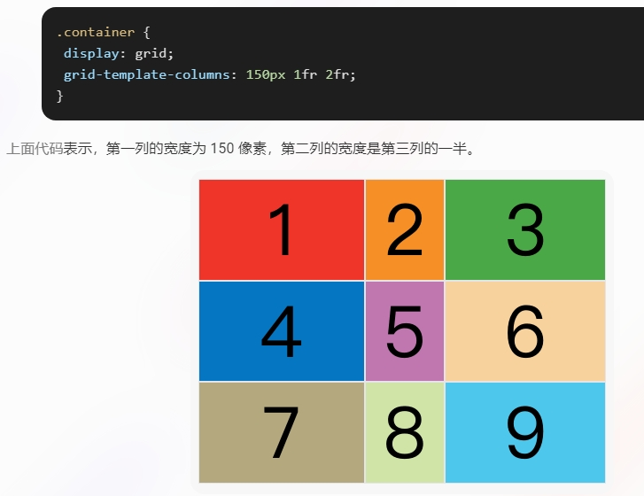
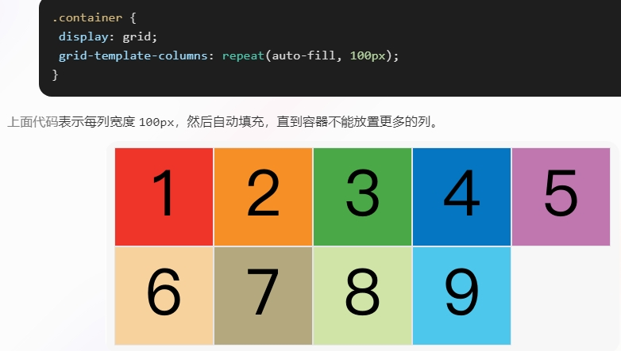

# 基础

## 定义

+ 使用 `grid-template-columns` 规则可划分列数（列宽）
+ 使用 `grid-template-rows` 划分行数（行高）

## 长度

+ px
+ em
+ rem
+ vw/vh
+ % (百分比，相对于容器的大小)

## 分数单位

+ `fr` （fraction 分数单位，表示可用空间的一部分）
+ 如果两列的宽度分别为 1fr 和 2fr，就表示后者是前者的两倍

+ fr 可以与绝对长度的单位结合使用，这时会非常方便

  ```css
  .container {
    display: grid;
    grid-template-columns: 150px 1fr 2fr;
  }
  ```

  

## 关键字

+ `auto` 示由浏览器自己决定长度

  ```css
  <!-- 第二列的宽度，基本上等于该列单元格的最大宽度，除非单元格内容设置了 min-width，且这个值大于最大宽度 -->
  grid-template-columns: 100px auto 100px;
  ```

+ `min-content` 设置大小为容器的最小尺寸
+ `max-content` 设置大小为容器的最大尺寸

## 函数

+ `repeat()` 允许重复相同大小的行或列多次
+ `minmax()`
+ `fit-content()`

### repeat()

+ 预定义的尺寸或重复模式

+ `auto-fill` 自动填充网格线

  + 有时，单元格的大小是固定的，但是容器的大小不确定
  + 如果希望每一行（或每一列）容纳尽可能多的单元格，这时可以使用 `auto-fill` 关键字表示自动填充

    

    ```css
    grid-template-rows: repeat(auto-fill, 100px);
    ```

+ `auto-fit` 与 `auto-fill` 两者的行为基本是相同的

  + 只有当容器足够宽，可以在一行容纳所有单元格，并且单元格宽度不固定的时候，才会有行为差异 `auto-fill` 会用空格子填满剩余宽度， `auto-fit` 则会尽量扩大单元格的宽度

    ```css
    grid-template-rows: repeat(auto-fit, 100px);
    ```

+ repeat() 函数只能作用于 `grid-template-columns` 和 `grid-template-rows` 这两个css属性上

### minmax()

+ `minmax()` 函数产生一个长度范围，表示长度就在这个范围之中。它接受两个参数，分别为最小值和最大值
+ 语法是 `minmax(min,max)`

  + min 最小值
  + max 最大值

  ```css
  /* 行高 最大100px 最小50px */
  grid-template-rows: repeat(2, minmax(50px,100px));
  ```

  ```css
  <!-- minmax(100px, 1fr) 表示列宽不小于 100px，不大于 1fr -->
  grid-template-rows: 100px minmax(100px, 1fr);
  ```

### fit-content()

+ `fit-content(limit) = max(min-content, min(limit, max-content))`

  ```css
  grid-template-rows: 100px fit-content(30px) 100px;
  ```

