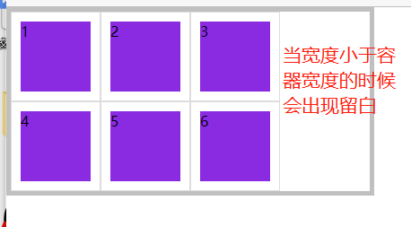

# 使用方式

## 方式1 固定宽高

+ 注意点：当容器宽度过大时将漏白

+ 示例

  ```html
  <article>
    <div>1</div>
    <div>2</div>
    <div>3</div>
    <div>4</div>
    <div>5</div>
    <div>6</div>
  </article>
  ```

  ```css
  article {
    width: 300px;
    height: 200px;
    border: solid 5px silver;
    display: grid;
    grid-template-rows: 100px 100px;
    grid-template-columns: 100px 100px 100px;
  }
  article div {
    background: blueviolet;
    background-clip: content-box;
    padding: 10px;
    border: solid 1px #ddd;
  }
  ```

  

## 方式2 百分比

+ 可以使用使用百分比自动适就容器

  ```css
  display: grid;
  grid-template-rows: 50% 50%;
  grid-template-columns: 25% 25% 25% 25%;
  ```

## 方式3 重复设置 repeat

+ 使用 `repeat` 统一设置值

  + 第一个参数为重复数量
  + 第二个参数是重复值

+ 示例1

  ```css
  grid-template-rows: repeat(2, 50%); /* 2行，每行高度占比 50% */
  grid-template-columns: repeat(2, 50%);
  ```

  

+ 示例2：可以设置多个值来定义重复，下面定义了四列，以 100%、20px 重复排列

  ```css
  display: grid;
  grid-template-rows: repeat(2, 50%);
  grid-template-columns: repeat(2, 100px 50px);
  ```

  

## 方式4 自动填充

+ 自动填充是根据容器尺寸，自动设置元素尺寸

  ```css
  article {
    width: 300px;
    height: 300px;
    border: 1px solid silver;
    display: grid;

    /* 行高 自动填充 每个 100px 高 */
    grid-template-rows: repeat(auto-fill, 100px);
    grid-template-columns: repeat(auto-fill, 100px);
  }
  ```

## 方式5 按比例设置 fr

+ 使用 `fr` 单位设置元素在空间中所占的比例，下面按1份-2份 分成两组共四列
+ 前提：容器需要设置固定高度，如果无意义

  ```css
  height: 100px;
  grid-template-rows: 50px 1fr 1fr;
  ```

+  单位组合

  

+ 重复定义

  

## 方式6 自动空间

+ 使用 `auto` 来让其获取所有剩余空间

  ```css
  main {
    display: grid;
    grid-template-rows: repeat(2, 1fr);
    grid-template-columns: 20vw auto 30vw;
  }
  div {
    background: blueviolet;
    border: solid 1px #ddd;
    color: white;
    padding: 5px;
  }
  ```

  ```html
  <main>
    <div href="">后盾人</div>
    <div href="">向军老师</div>
    <div href="">HDCMS.COM</div>
  </main>
  ```
