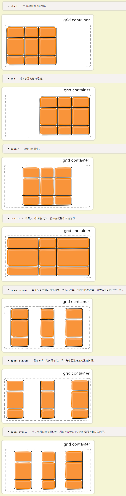
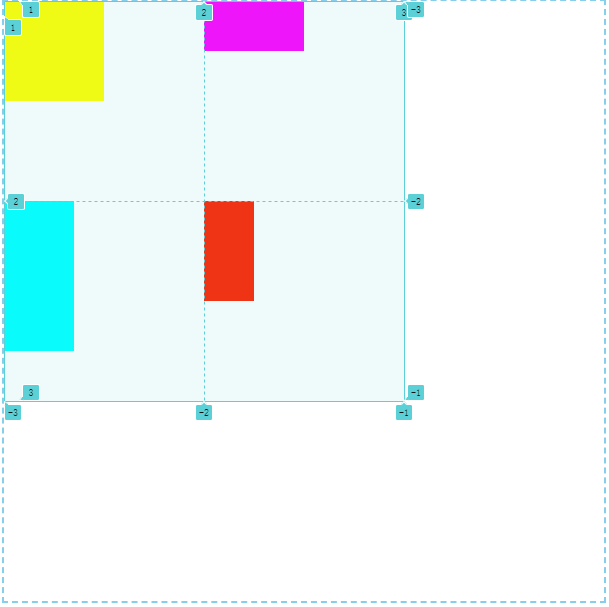
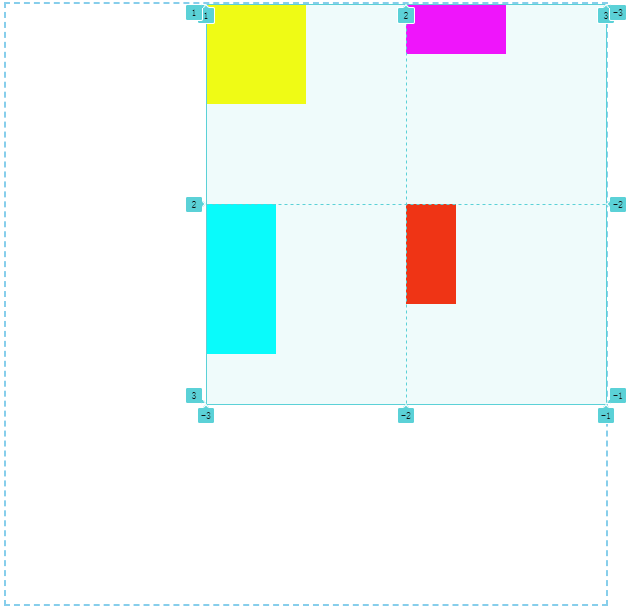
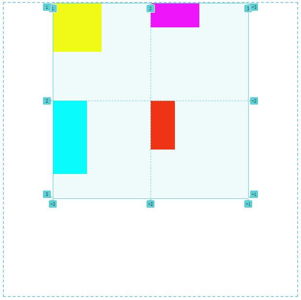
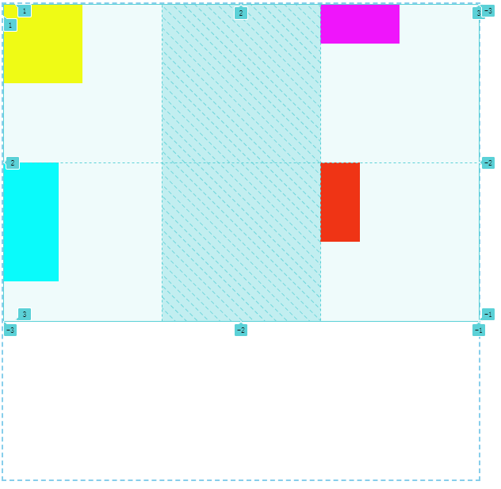
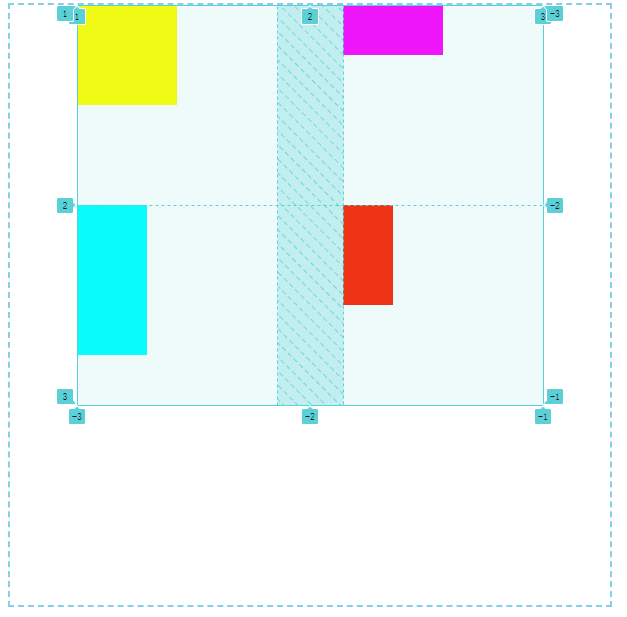
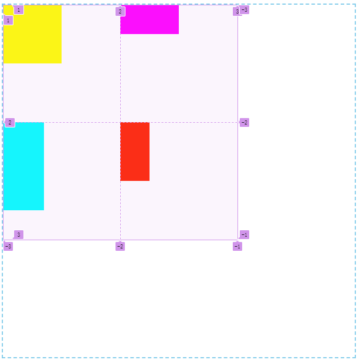
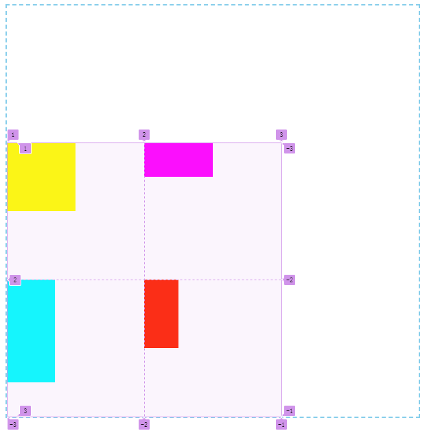
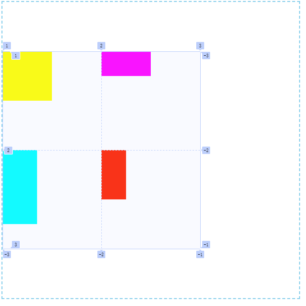

# 对齐方式

## 概述

+ `justify-content` 属性是整个内容区域在容器里面的水平位置（左中右）
+ `align-content` 属性是整个内容区域的垂直位置（上中下）

## 属性

+ `justify-content` 所有栅格在容器中的水平对齐方式，容器有额外空间时

  

  + `start` 容器左边

    

  + `end` 容器右边

    

  + `center` 容器中间

    

  + `space-between` 第一个栅格靠左边，最后一个栅格靠右边，余下元素平均分配空间

    

  + `space-around` 每个元素两侧的间隔相等。所以，栅格之间的间隔比栅格与容器边距的间隔大一倍

    

  + `space-evenly` 栅格间距离完全平均分配

    

+ `align-content` 所有栅格在容器中的垂直对齐方式，容器有额外空间时

  + `start` 容器顶边

    

  + `end` 容器底边

    

  + `center` 容器垂直中间

    

  + `stretch` 撑满容器

  + `space-between` 第一个栅格靠左边，最后一个栅格靠右边，余下元素平均分配空间
  + `space-around` 每个元素两侧的间隔相等。所以，栅格之间的间隔比栅格与容器边距的间隔大一倍
  + `space-evenly` 栅格间距离完全平均分配

## 简写

+ `place-content` 用于控制栅格的对齐方式

  ```css
  place-content: <align-content> <justify-content>
  ```
