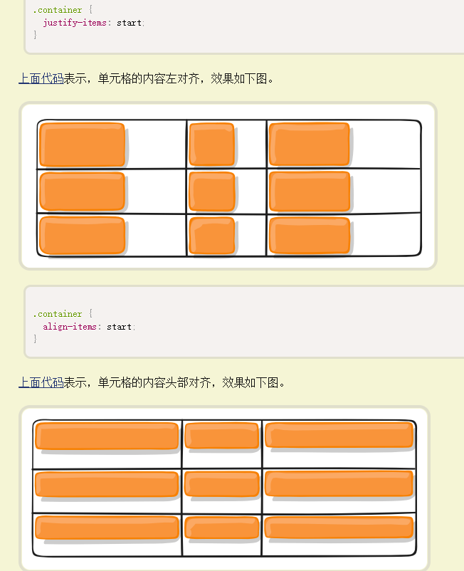
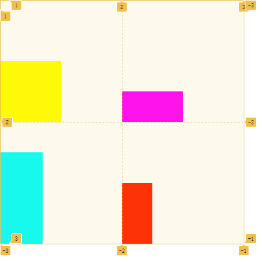
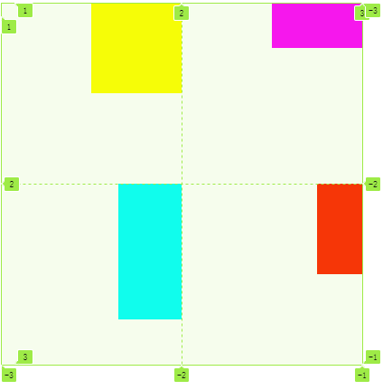
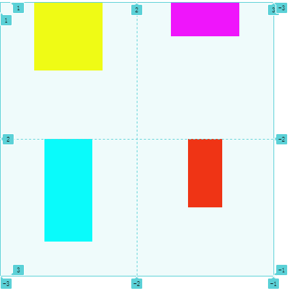

# 元素对齐

## 概述

+ `justify-items` 与 `align-items` 用于控制所有栅格内元素的对齐方式

+ `justify-items` 用于控制元素的*水平*对齐方式
+ `align-items` 用于控制元素的*垂直*对齐方式

  

## 属性 align-items

+ `align-items` 栅格内所有元素的垂直排列方式

  + `start` 上对齐

    

  + `end` 下对齐

    

  + `center` 居中对齐

    

  + `stretch` 拉伸，占满单元格的整个宽度

    

  + baseline 按照文字基线对齐（有文字按照文字对齐，没有的话按照元素底部对齐）

  + normal **默认值** 会根据使用场景的不同表现为 `stretch` 或者 `start`

    + 如果grid子项是具有内在尺寸或具有内在比例的元素，则此时normal的表现类似于start属性值的表现

    


## 属性 justify-items

+ `justify-items` 栅格内所有元素的横向排列方式

  + `start` 左对齐

    

  + `end` 右对齐

    

  + `center` 居中对齐

    

  + `stretch` 拉伸，占满单元格的整个宽度 **默认**

    

## 简写

+ `place-items` 控制所有元素的对齐方式

  ```css
  place-items: <align-items> <justify-items>
  ```

  ```css
  place-items: start end;
  ```
