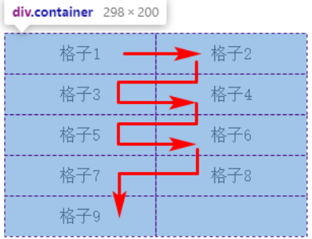

# grid-auto-flow

## 概述

+ 用于指定在自动生成的网格项目放置到网格容器中时的放置顺序

  + row: 表示没有指定位置的网格在水平（行）方向上自然排列

    

  + column: 没有指定位置的网格在垂直（列）方向上自然排列

    

  + dense: 自然排列启用“密集”打包算法，也就是说，如果稍后出现的网格比较小，则尝试看看其前面有没有合适的地方放置该网格，使网格尽可能排列紧凑
