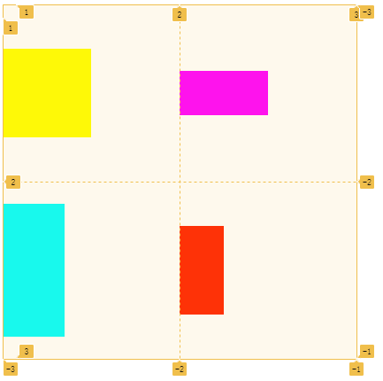
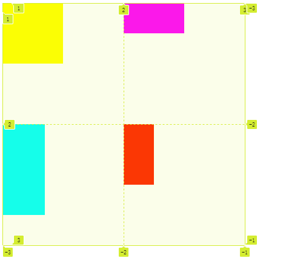
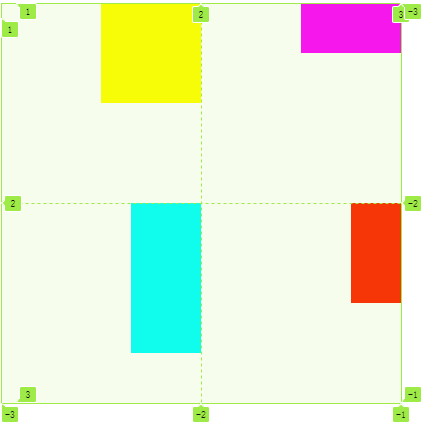
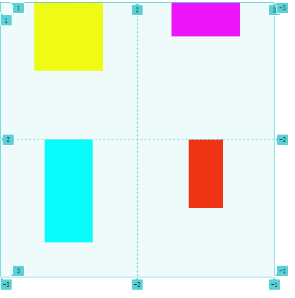

# 元素对齐

## 概述

+ `justify-items` 与 `align-items` 用于控制所有栅格内元素的对齐方式

+ `justify-items` 用于控制元素的水平对齐方式
+ `align-items` 用于控制元素的垂直对齐方式

  

## 属性 align-items

+ `align-items` 栅格内所有元素的垂直排列方式

  + `start` 元素对齐栅格的顶边

    

  + `end` 元素对齐栅格的底边

    

  + `center` 元素对齐栅格的垂直中间

    

  + `stretch` 垂直撑满栅格 **默认**

    

## 属性 justify-items

+ `justify-items` 栅格内所有元素的横向排列方式

  + `start` 元素对齐栅格的左边

    

  + `end` 元素对齐栅格的右边

    

  + `center` 元素对齐栅格的中间

    

  + `stretch` 水平撑满栅格 **默认**

    

## 简写

+ `place-items` 控制所有元素的对齐方式

  ```css
  place-items: <align-items> <justify-items>
  ```

  ```css
  place-items: start end;
  ```
