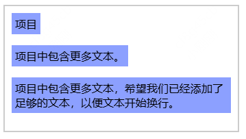

# 全局属性

## fit-content

+ 意味着盒子会使用可用空间，但绝不会超过 max-content

+ 当用作 width、height、min-width、min-height、max-width 和 max-height 的布局盒子尺寸时，最大和最小尺寸指的是内容尺寸

  ```css
  width: fit-content;

  block-size: fit-content;
  ```

+ 示例

  ```html
  <style>
    .container {
      border: 2px solid #ccc;
      padding: 10px;
      width: 20em;
    }

    .item {
      width: fit-content;
      background-color: #8ca0ff;
      padding: 5px;
      margin-bottom: 1em;
    }
  </style>

  <div class="container">
    <div class="item">项目</div>
    <div class="item">项目中包含更多文本。</div>
    <div class="item">
      项目中包含更多文本，希望我们已经添加了足够的文本，以便文本开始换行。
    </div>
  </div>
  ```

    

## max-content


## min-content

## inherit 继承

+ 使得元素获取其父元素的计算值

+ 该关键字只是增强了属性的默认行为，通常只在覆盖原有的值的时候使用

  ```css
  /* 设置二级标题的颜色为绿色 */
  h2 {
    color: green;
  }

  /* 保留 sidebar 内二级标题元素的样式，使其继承父元素的颜色 */
  #sidebar h2 {
    color: inherit;
  }
  ```

## initial 默认值

+ 将属性的初始（或默认）值应用于元素
+ 不建议使用，考虑使用 inherit, unset，或revert 关键字代替

## unset

+ 情况1：如果这个属性本来有从父级继承的值（这个属性默认可以继承，且父级有定义），则将该属性重新设置为继承的值 类似于 `inherit`
+ 情况2：如果没有继承父级样式，则将该属性重新设置为初始值 类似于 `initial`


## revert


## revert-layer

