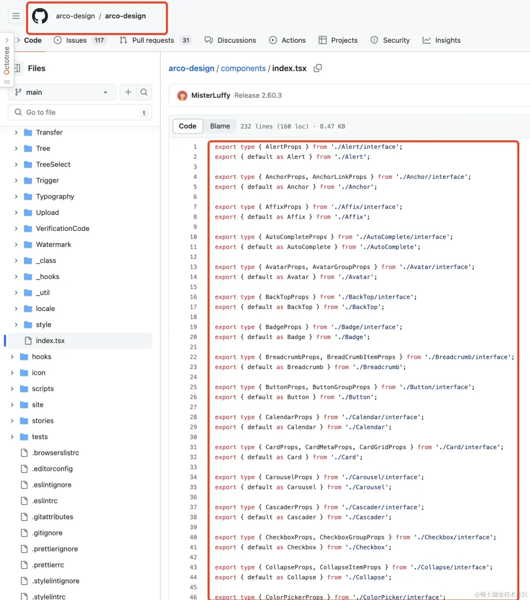

# 模块重导 Re-export

## 解决的问题

+ 通过重导在 `comonents/index.tsx` 文件暴露所有组件，在使用时一个import就可以使用N个组件了

  ```js
  // 不使用重导
  import Modal from "@arco-design/web-ract/es/modal"
  import Checkbox from "@arco-design/web-ract/es/Checkbox"
  import Message from "@arco-design/web-ract/es/Message"

  // 使用模块重导
  import {Modal,Checkbox,Message} from "@arco-design/web-ract"
  ```

## 概述

+ Re-export一般用于收拢同类型的模块、一般都是以文件夹为单位，如components、routes、utils、hooks、stories等都通过各自的index.tsx暴露，这样就能极大程度的简化导入路径、提升代码可读性、可维护性

  

## Re-export的几种形式

1. 直接重导出:直接从另一个模块重导出特定的成员

    ```js
    export { foo, bar } from './moduleA';
    ```

2. 重命名并重导出（含默认导出）:从另一个模块导入成员，可能会重命名它们，然后再导出。默认导出也可以重命名并重导出

    ```js
    // 通过export导出的
    export { foo as newFoo, bar as newBar } from './moduleA';

    // 通过export default导出的
    export { default as ModuleDDefault } from './moduleD';
    ```

3. 重导出整个模块（不含默认导出）：将另一个模块的所有导出成员作为单个对象重导出。（注意：整个导出不会包含export default）

    ```js
    export * from './moduleA';
    ```


4. 收拢、结合导入与重导出：首先导入模块中的成员，然后使用它们，最后将其重导出

    ```js
    import { foo, bar } from './moduleA';
    export { foo, bar };
    ```

## 使用require.context

+ require.context 是一个非常有用的功能，它允许我们动态地导入一组模块，而不需要显式地一个接一个地导入

+ 只需一段代码让你只管增加文件、组件,将自动收拢重导

+ 在项目路由、状态管理等固定场景下极其好使（能提效、尽可能避免了增加一个配置要动N个文件的情况）

+ 尤其是在配置路由时、产生大批量的import（多少个页面就得导入多少个import😅）

  ```js
  // 不使用require.context
  import A form '@/pages/A'
  import B form '@/pages/B'
  ...

  // routes/index.ts文件统一处理
  // 创建一个context来导入routes目录下所有的 .ts 文件
  const routesContext = require.context('./routes', false, /.ts$/);
  const routes = [];

  // 遍历 context 中的每个模块
  routesContext.keys().forEach(modulePath => {
    // 获取模块的导出
    const route = routesContext(modulePath);
    // 获取组件名称【如果需要话】，例如：从 "./Header.ts" 提取 "Header"
    // const routeName = modulePath.replace(/^./(.*).\w+$/, '$1');
    // 将组件存储在组件对象中
    routes.push(route.default || route)
  });

  export default routes;
  ```

+ 在大项目、多路由的情况下，使用 `require.context` 在处理路由导入上大有可为

## 使用import动态导入

+ 动态import也能实现类似require.context的功能、动态收拢模块
