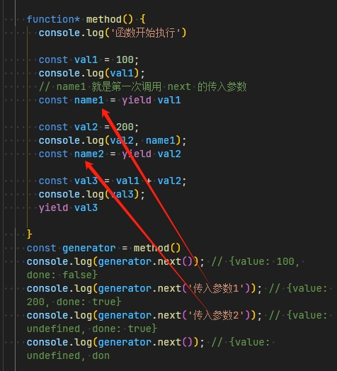
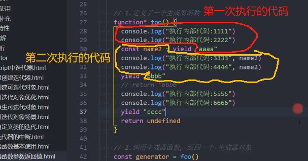

# 生成器的返回值和参数

## 传入参数

+ 调用 `next` 函数的时候，传入参数会作为上一个 `yield` 语句的返回值

  ```js
  function* method(name1) {
    console.log('函数开始执行')

    const val1 = 100;
    console.log(val1);
    // name1 就是第一次调用 next 的传入参数
    const name2 = yield val1

    const val2 = 200;
    console.log(val2, name1);
    const name3 = yield val2

    const val3 = val1 + val2;
    console.log(val3);
    yield val3
    return undefined

  }
  const generator = method('第一次执行的参数')
  console.log(generator.next()); // {value: 100, done: false}
  console.log(generator.next('传入参数1')); // {value: 200, done: false}
  console.log(generator.next('传入参数2')); // {value: 300, done: false}
  console.log(generator.next()); // {value: undefined, don
  ```

  
  
