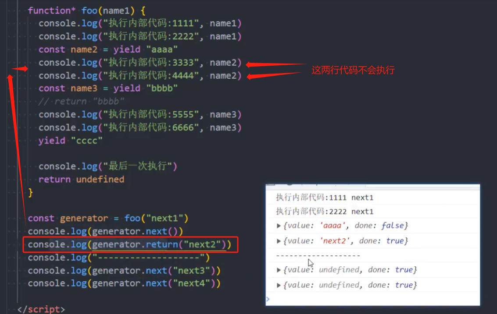
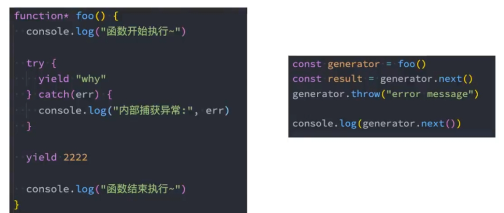

# 生成器函数提前结束

## 生成器提前结束 - return 函数

+ `generator.return` 提前结束函数
+ return 传值后这个生成器函数就会结束，之后调用 next 就不知继续生成值了

  

  ```js
  function* method(name1) {
    console.log('函数开始执行')

    const val1 = 100;
    console.log(val1);
    // name1 就是第一次调用 next 的传入参数
    const name2 = yield val1

    const val2 = 200;
    console.log(val2, name1);
    const name3 = yield val2

    const val3 = val1 + val2;
    console.log(val3);
    yield val3

    console.log('最后一次执行');

    return undefined

  }
  const generator = method('第一次执行的参数')
  console.log(generator.next()); // {value: 100, done: false}

  // 代码提前结束
  console.log(generator.return('传入参数1')); // {value: '传入参数1', done: true}
  console.log(generator.next('传入参数2')); // {value: undefined, done: true}
  console.log(generator.next()); //{value: undefined, done: true}
  ```

## 生成器提前结束 - throw 函数

+ `generator.throw` 向函数抛出一个异常
+ 抛出异常后我们可以在生成器函数中捕获异常
+ 但是在 `catch` 语句中不能继续 `yield` 新的值了，但是可以在 `catch` 语句外使用 `yield` 继续中断函数的执行

  
