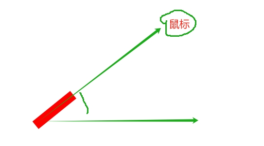

# 总是指向鼠标的箭头

## 概述

+ 监听指向鼠标

  

  ```html
  <style>
    * {
      margin: 0;
      padding: 0;
    }

    :root, body {
      width: 100%;
      height: 100%;
    }

    div.arrow {
      position: absolute;
      top: 50%;
      left: 50%;
      transform: translate(-50%, -100%) rotateZ(0deg);
      transform-origin: bottom;
      width: 20px;
      height: 100px;
      background-color: red;
      transition: transition 0.5s;
    }
  </style>

  <div class="arrow"></div>

  <script>
    const divDom = document.querySelector('.arrow');
    const bodyDom = document.querySelector('body');

    // 获取中心点的坐标
    const getCentenXY = () => {
      const x = Math.ceil(window.innerWidth / 2); // 中心点的坐标
      const y = Math.ceil(window.innerHeight / 2);

      return [x,y];
    };

    // 获取顶点的坐标
    const getArrow = (x, y) => {
      x - 100
    }

    // 中心点的坐标
    let [divX, divY] = getCentenXY();

    bodyDom.addEventListener('mousemove', e => {
      // console.log(e.clientX ,' +   ', e.clientY);

      const l = Math.atan2(e.clientY - divY, e.clientX - divX) * 180/Math.PI + 90;
      // console.log(l);/

      divDom.style.transform = `translate(-50%, -100%) rotateZ(${l}deg)`
    })


  </script>
  ```
