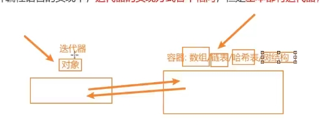

# 基础

## 概述

+ Iterator 对象是一个符合迭代器协议的对象，其提供了 next() 方法用以返回迭代器结果对象
+ 所有内置迭代器都继承自 Iterator 类
+ Iterator 类提供了 `[Symbol.iterator]()` 方法，该方法返回迭代器对象本身，使迭代器也可迭代。它还提供了一些使用迭代器的辅助方法

  

+ 每个迭代器都有一个不同的原型对象，它定义了特定迭代器使用的 next() 方法
+
  + 例如，所有字符串迭代器对象都继承自隐藏对象 StringIteratorPrototype，该对象具有按码位迭代当前字符串的 next() 方法
  + StringIteratorPrototype 还有一个 `[Symbol.toStringTag]` 属性，其初始值为字符串 "String Iterator"。该属性在 Object.prototype.toString() 中使用
  + 类似地，其他迭代器原型也有自己的 `[Symbol.toStringTag]` 值，这些值与上面给出的名称相同

+ 所有这些原型对象都继承自 Iterator.prototype，它提供了一个返回迭代器对象本身的 `[Symbol.iterator]()` 方法，这使迭代器也变得可迭代

## 内置的 JavaScript 迭代器

+ 数组迭代器，返回自 `Array.prototype.values()` 、 `Array.prototype.keys()` 、 `Array.prototype.entries()` 、 `Array.prototype[Symbol.iterator]()` 、 `TypedArray.prototype.values()` 、 `TypedArray.prototype.keys()` 、 `TypedArray.prototype.entries()` 、 `TypedArray.prototype[Symbol.iterator]()` 和 `arguments[Symbol.iterator]()`

+ 字符串迭代器，返回自 `String.prototype[Symbol.iterator]()`

+ Map 迭代器，返回自 `Map.prototype.values()` 、`Map.prototype.keys()` 、` Map.prototype.entries()` 和 `Map.prototype[Symbol.iterator]()`

+ Set 迭代器，返回自 `Set.prototype.values()` 、 `Set.prototype.keys()` 、 `Set.prototype.entries()` 和 `Set.prototype[Symbol.iterator]()`

+ 正则表达式字符串迭代器，返回自 `RegExp.prototype[Symbol.matchAll]()` 和 `String.prototype.matchAll()`

+ Generator 对象，返回自生成器函数

+ Segment 迭代器，返回自 `Intl.Segmenter.prototype.segment()` 返回的 Segments 对象的 `[Symbol.iterator]()` 方法

+ 迭代器辅助方法，返回自迭代器辅助方法例如 `Iterator.prototype.filter()` 和 `Iterator.prototype.map()`

