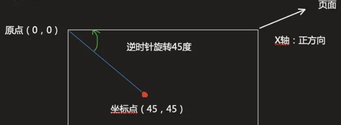

# 反三角函数

## 概述

+ 根据两条边求角度或弧度

## Math.asin()

+ `Math.asin(x)`

  + 参数

    + x 一个数值

  + 返回值 返回一个介于 -PI/2 到 PI/2 之间的弧度值

    + 如果接受的参数值超出范围，则返回 `NaN`

  

## Math.acos(x)

+ 返回一个数的反余弦值

  

## Math.atan(x)

+ 返回一个数的反正切值

  

## Math.acosh(x)

+ 返回一个数的反双曲余弦值

## Math.asinh(x)

+ 返回一个数的反双曲正弦值

## Math.atanh(x)

+ 返回一个数的反双曲正切值

## Math.atan2(y, x)

+ 返回 y/x 的反正切值

  

