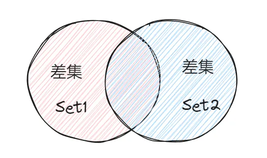
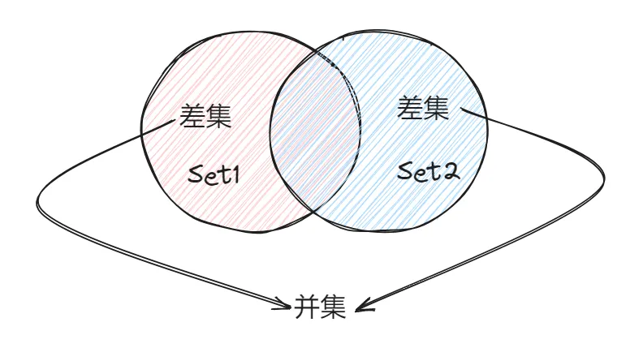
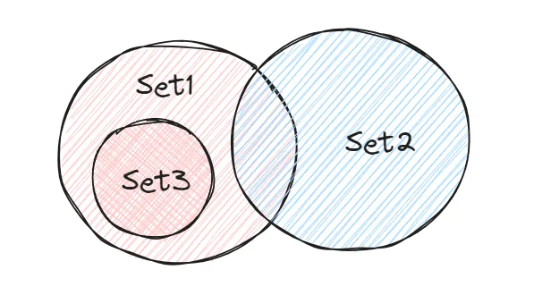

# 交集、并集与差集

## intersection() 交集

+ 这个方法用于取两个 Set 的 交集

  

+ 示例

  ```js
  const set1 = new Set([1,2,3,4,5,'apple','peach']);
  const set2 = new Set([3,5,'apple',10]);

  // 取交集
  set1.intersection(set2); // set{3,5,'apple'}
  ```

## union()

+ 这个方法用于取两个 Set 的 并集

  

+ 示例

  ```js
  const set1 = new Set([1,2,3,4,5,'apple','peach']);
  const set2 = new Set([3,5,'apple',10]);

  // 取并集
  set1.union(set2); // set{1,2,3,4,5,'apple','peach', 10}
  ```

## difference()

+ 这个方法用于取两个 Set 的 差集

  

+ 示例

  ```js
  const set1 = new Set([1,2,3,4,5,'apple','peach']);
  const set2 = new Set([3,5,'apple',10]);

  // set1 相对与 set2 的差集
  set1.difference(set2); // set{1,2,4,'peach'}

  // set2 相对与 set1 的差集
  set2.difference(set1); // set{10}
  ```

## symmetricDifference()

+ 这个方法用于取两个 Set 的 差集 的 并集

  

+ 示例

  ```js
  const set1 = new Set([1,2,3,4,5,'apple','peach']);
  const set2 = new Set([3,5,'apple',10]);

  // 差集 的 并集（顺序决定于谁调用 symmetricDifference）
  set1.symmetricDifference(set2); // set{1,2,4,'peach', 10}

  // set2 相对与 set1 的差集
  set2.symmetricDifference(set1); // set{10, 1,2,4,'peach'}
  ```

## isSubsetOf()

+ 这个方法判断 Set 是否是另一个 Set 的 子集，是的话返回 true，否则返回false

  

+ 示例

  ```js
  const set1 = new Set([1,2,3,4,5,'apple','peach']);
  const set2 = new Set([3,5,'apple',10]);
  const set3 = new Set([1,5,'peach']);

  set2.isSubsetOf(set1); // false

  // set2 相对与 set1 的差集
  set3.isSubsetOf(set1); // true
  ```

## isSupersetOf

+ 这个方法判断 Set 是否是另一个 Set 的 超集，是的话返回 true，否则返回false

+ 其实跟 isSubsetOf() 很相似，只不过前后角色顺序反过来了罢了

  

+ 示例

  ```js
  const set1 = new Set([1,2,3,4,5,'apple','peach']);
  const set2 = new Set([3,5,'apple',10]);
  const set3 = new Set([1,5,'peach']);

  set1.isSubsetOf(set2); // false

  set1.isSubsetOf(set3); // true
  ```

## isDisjointFrom

+ 这个方法判断 Set 是否与另一个 Set 无交集，是的话返回 true，否则返回false

  

+ 示例

  ```js
  const set1 = new Set([1,2,3,4,5,'apple','peach']);
  const set2 = new Set([3,5,'apple',10]);
  const set3 = new Set([1,5,'peach']);

  // set 是否与另外一个 set 无交集
  set1.isDisjointFrom(set2); // false

  set1.isDisjointFrom(set3); // true
  ```
