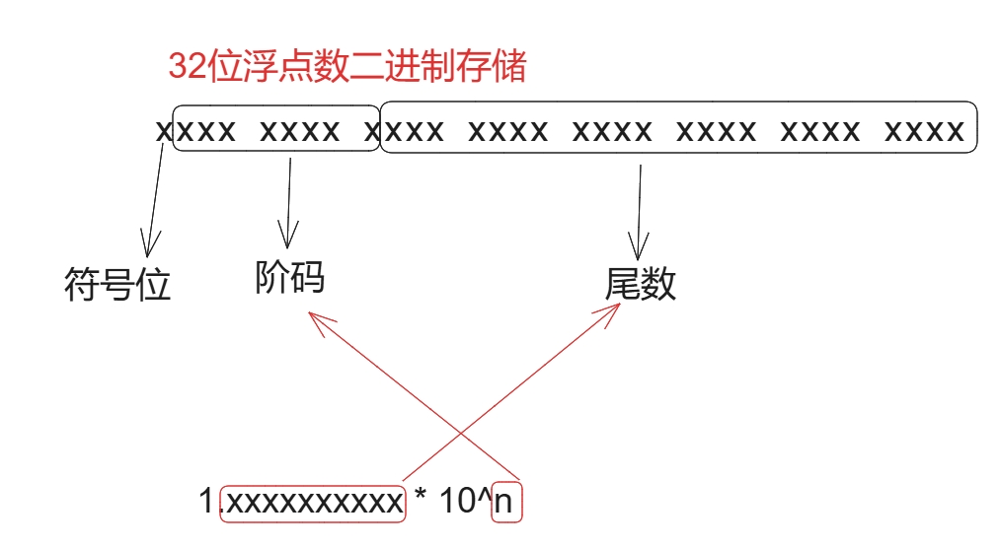

# 数据存储前置知识

## 概述

+ 计算机必须使用固定的位数来存储数字，无论存储的数字是大还是小，在内存中占用的空间是一定的

  ```
  0 与 10000 在内存中占用的空间大小是一样的
  ```

+ n位的无符号整数能表示的数字是 2^n 个，取值范围是 0 ~ 2^n - 1
+ n位的有符号整数能表示的数字是 2^n 个，取值范围是 -2^(n-1) ~ 2^(n-1) - 1

+ JS 中所有的数字均使用*双精度*浮点数保存

## 浮点数

+ 浮点数表示法可以用于表示整数和小数

  + 32位浮点数：又称为单精度浮点数，它用1位表示符号，8位表示阶码，23位表示尾数

    ```
    // 32二进制
    xxxx xxxx xxxx xxxx xxxx xxxx xxxx xxxx
    ```

  + 64位浮点数：又称为双精度浮点数，它用1位表示符号，11位表示阶码，52位表示尾数

  ```
  // 任何数字编程
  1.xxxxxx * 10^n

  xxxxxx 尾数
  n      阶码
  ```

  
