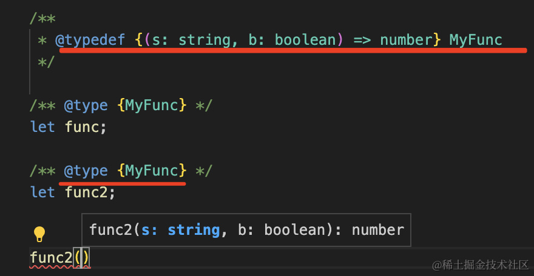
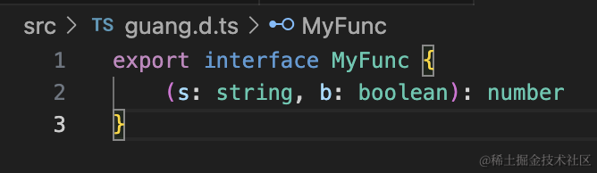
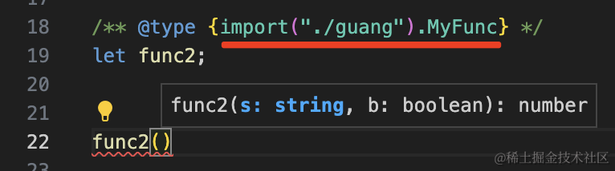

# 类型抽取

## @typedef

+ 如果类型被多处用到，可以用 `@typedef` 抽出来，单独命名

  

## 普通文件

+ 方式1：如果文件引入了需要使用的变量或函数，则可以直接在类型中使用

  ```js
  import {a} from "./utils.js"

  /** @type {a.MyFunc} */
  let b;
  ```

+ 方式2

  ```js
  /** @type {import('./guang').MyFunc} */
  let a;
  ```

## dts 文件

+ 以把这个类型放到 d.ts 文件里，在这里 `import` 进来用

  ```js
  // guang.d.ts
  export type MyFunc = {
    (a: number, b: number): number
  }
  ```

  ```js
  // index.js

  // @ts-check
  /** @type {import('./guang').MyFunc} */
  let a;
  ```

  
  

+ 这样就避免了在 `@typedef` 里写大段类型定义了，因为那里也不能换行，代码写多了就不好维护了
