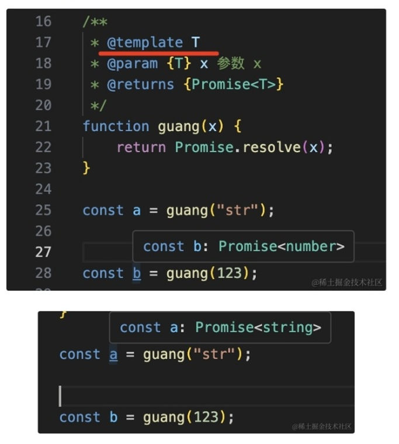

# 泛型

## @template

+ 通过 `@template` 声明类型参数

  ```js
  /**
   * @template T
   * @param {T} x 参数 x
   * @returns {Promise<T>}
   */
  const gunang = (x) => {
    return Promise.resolve(x);
  };
  ```

  
