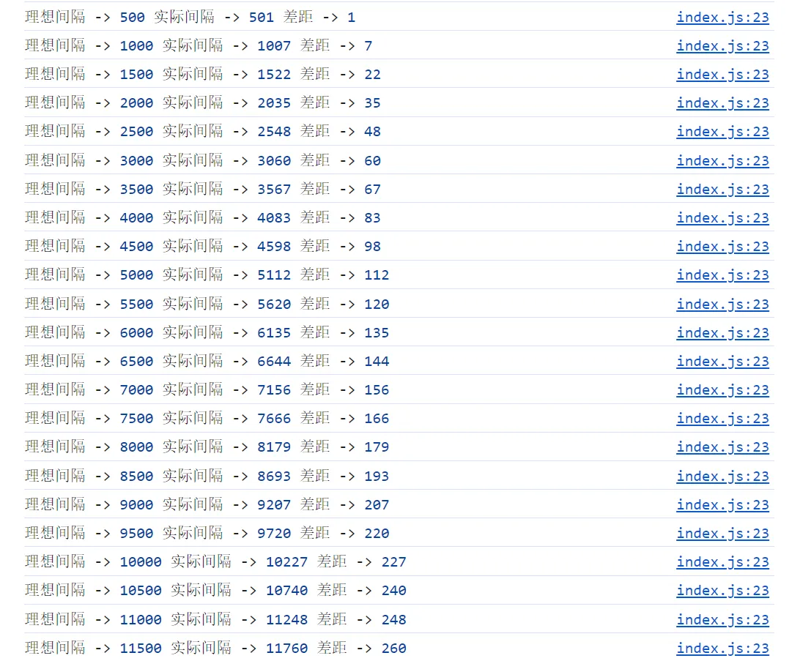

# setTimeout 定时器不准时

## 概述

+ 平时我们都会使用 setTimeout 来当做定时器，平时的基本用法如下

  ```js
  const speed = 500;
  setTimeout(() => {
    console.log("定时器执行")
  }, speed);
  ```

+ 是为了节省性能，我们也会让 `setTimeout` 来实现 `setInterval`

  ```js
  const speed = 500;
  const fn = () => {
    setTimeout(() => {
      console.log("定时器执行")

      // 继续执行
      fn();
    }, speed);
  };
  fn();
  ```

## 不准时

+ 实际的执行时间 跟 理想的执行时间 是否一致

  ```js
  let count = 1;
  const speed = 500;
  const startTime = new Date().getTime();
  const fn = () => {
    setTimeout(() => {
      const shiji = new Date().getTime(); - startTime;
      const lixiang = count * speed;
      console.log("理想间隔--》", lixiang, shiji, "差距--》", shiji - lixiang);

      // 继续执行
      fn();
    }, speed);
  };
  fn();
  ```

+ ， 实际的执行时间 跟 理想的执行时间 是不一致的，也就是说 setTimeout 不是准时的，是有差距的

  

+ 接着差距会不断加大，到了一定差距的时候，就基本保持不变了，这可能也跟电脑有关系，每个人的电脑不一样，差距也不一样

## 精准的定时器

+ 那么想要实现一个准时的定时器，应该怎么实现呢？我们可以使用 requestAnimationFrame 来实现

  ```js
  const speed = 500;
  let startTime = new Date().getTime();
  const fn = () => {
    requestAnimationFrame(() => {
      const delay = new Date().getTime(); - startTime;
      if(delay >= 500) {
        // 重置开始时间
        startTime = new Date().getTime();
        console.log('定时器执行')
      }
      fn()
    })
  };
  fn();
  ```


