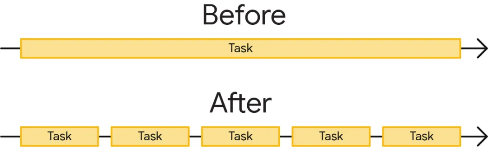
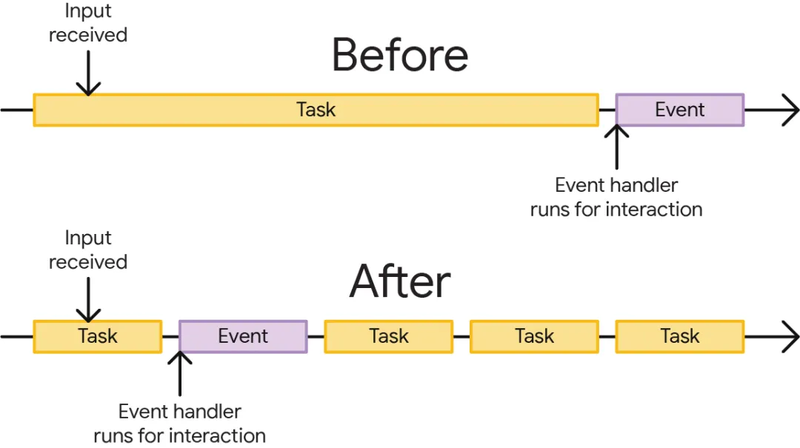

# 减少网页卡顿

## 办法

+ 不要阻塞主线程

+ 减少长耗时

  + 将单个长耗时任务拆解成几个耗时相对短的小任务

## 为什么需要拆分任务

+ 主线程每次只能处理一个任务，当任务耗时超过特定时间，比如 50ms 就会被归类为长耗时。如果发生长耗时时存在用户交互，或者关键渲染更新时，浏览器就会延后再处理用户交互，这会直接导致用户交互或者渲染出现延迟

+ 优化长耗时，意味着将单个长耗时任务拆解成几个耗时相对短的小任务

  

+ 为什么需要拆分任务非常重要？因为拆分长任务后，浏览器就有了更多的机会，可以去处理优先级别更高的工作，其中就包括用户交互行为

  

+ 如果任务非常长，浏览器对用户交互的展示如图所示，这时候浏览器就没法快速处理用户交互，但拆分长任务后的从图中能看到效果就不一样

+ 因为长任务的缘故，用户交互产生的事件处理就必须排队，等待长任务执行完后才能执行。这个时候就会导致用户交互的延迟。当拆分成较短的任务后，事件处理器就有机会更快的触发

+ 因为事件处理器能够在短任务之间得以执行，也就比长任务耗时更短。在长耗时的图片中，用户可能就会感到卡顿；长任务拆分后，用户可能就感觉体验很流畅

+ 然而问题来了，那就是 减少长耗时到底该怎么做，不要阻塞主线程写的也不够明确
