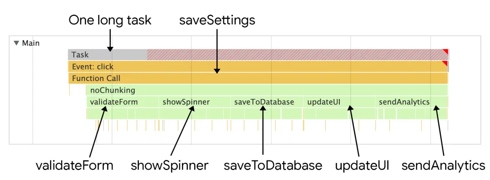
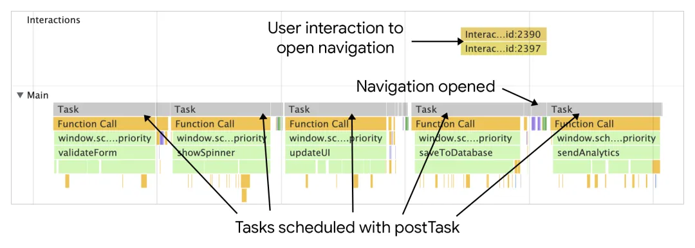

# 任务管理策略

## 概述

+ 软件架构中有时候会将一个任务拆分成多个函数，这不仅能增强代码可读性，也让项目更容易维护，当然这样也更容易写测试

  ```js
  function saveSettings () {
    validateForm();
    showSpinner();
    saveToDatabase();
    updateUI();
    sendAnalytics();
  }
  ```

+ 但是 saveSetting 这个函数调用 5 个函数，这个函数的执行看起来就像一个特别长的长的任务

  

## 解决方式1：使用代码延迟任务执行

+ 为了拆分长任务，开发者经常使用定时器 setTimeout
+ 通过把方法传递给 setTimeout，也就等同于重新创建了一个新的任务，延迟了回调的执行，而且使用该方法，即便是将 delay 时间设定成 0，也是有效的

  ```js
  function saveSettings () {
    // Do critical work that is user-visible:
    validateForm();
    showSpinner();
    updateUI();

    // Defer work that isn't user-visible to a separate task:
    setTimeout(() => {
      saveToDatabase();
      sendAnalytics();
    }, 0);
  }
  ```

+ 如果需执行的函数先后关系是很明确，这个方法会非常有效，然而并不是所有场景都能使用这个方法。比如，如需要在循环中处理大数据量的数据，这个任务的耗时可能就会非常长（假设有数百万的数据量）

  ```js
  function processData () {
    for (const item of largeDataArray) {
      // Process the individual item here.
    }
  }
  ```

## 使用 async、await 来创造让步点

+ 当让步于主线程后，浏览器就有机会处理那些更重要的任务，而不是放在队列中排队
+ 理想状态下，一旦出现用户界面级别的任务，就应该让步给主线程，让任务更快的执行完
+ 让步于主线程让更重要的工作能更快的完成

+ 分解任务后，按照浏览器内部的优先级别划分，其他的任务可能优先级别调整的会更高。一种让步于主线程的方式是配合用了 setTimeout 的 promise

  ```js
  function yieldToMain () {
    return new Promise(resolve => {
      setTimeout(resolve, 0);
    });
  }
  ```

+ 在 saveSettings 的函数中，可以在每次 await 函数 yieldToMain 后让步于主线程

  ```js
  async function saveSettings () {
    // Create an array of functions to run:
    const tasks = [validateForm,showSpinner,saveToDatabase,updateUI,sendAnalytics]

    // Loop over the tasks:
    while (tasks.length > 0) {
      // Shift the first task off the tasks array:
      const task = tasks.shift();

      // Run the task:
      task();

      // Yield to the main thread:
      await yieldToMain();
    }
  }
  ```

+ 这样的好处是，就能看到单个大的长任务被拆分成了多个独立的任务

  

### 注意

+ 并不是所有函数调用都要让步于主线程
+ 如果两个函数的结果在用户界面上有重要的更新，最好就不要这样做
+ 如果可以，可以想让任务执行，然后考虑在那些不重要的函数或者能在后台运行的函数之间让步

## 只在必要时让步

+ 假如有一堆的任务，但是只想在用户交互的时候才让步，该怎么办？正好有这种 api-- `isInputPending`
+ `isInputPending` 这个函数可以在任何时候调用，它能判断用户是否要与页面元素进行交互
+ 调用 `isInputPending` 会返回布尔值， `true` 代表要与页面元素交互， `false` 则不交互

+ 比如说，任务队列中有很多任务，但是不想阻挡用户输入，使用 isInputPending 和自定义方法 yieldToMain 方法，就能够保证用户交互时的 input 不会延迟

  ```js
  async function saveSettings () {
    // 函数队列
    const tasks = [validateForm,showSpinner,saveToDatabase,updateUI,sendAnalytics];

    while (tasks.length > 0) {
      // 让步于用户输入
      if (navigator.scheduling.isInputPending()) {
        // 如果有用户输入在等待，则让步
        await yieldToMain();
      } else {
        // Shift the the task out of the queue:
        const task = tasks.shift();

        // Run the task:
        task();
      }
    }
  }
  ```

+ 在 saveSetting 执行过程中，会逐个循环队列中的任务。如果循环时 isInputPending 结果返回真，saveSetting 就会调用 yieldToMain 函数，这样就能处理用户输入的事件，反之，就会走到队列继续执行下一个，直到队列执行完

  

## 专门编排优先级的 api

+ postTask 允许更细粒度的编排任务，该方法能让浏览器编排任务的优先级，以便地优先级别的任务能够让步于主线程。目前 postTask 使用 promise，接受优先级这个参数设定。

+ postTask 方法有三个优先级别：

  + background 级，适用于优先级别最低的任务
  + user-visible 级，适用于优先级别中等的任务，如果没有入参，也是该函数的默认参数
  + user-blocking 级，适用于优先级别最高的任务

  ```js
  function saveSettings () {
    // Validate the form at high priority
    scheduler.postTask(validateForm, {priority: 'user-blocking'});

    // Show the spinner at high priority:
    scheduler.postTask(showSpinner, {priority: 'user-blocking'});

    // Update the database in the background:
    scheduler.postTask(saveToDatabase, {priority: 'background'});

    // Update the user interface at high priority:
    scheduler.postTask(updateUI, {priority: 'user-blocking'});

    // Send analytics data in the background:
    scheduler.postTask(sendAnalytics, {priority: 'background'});
  };
  ```

  
