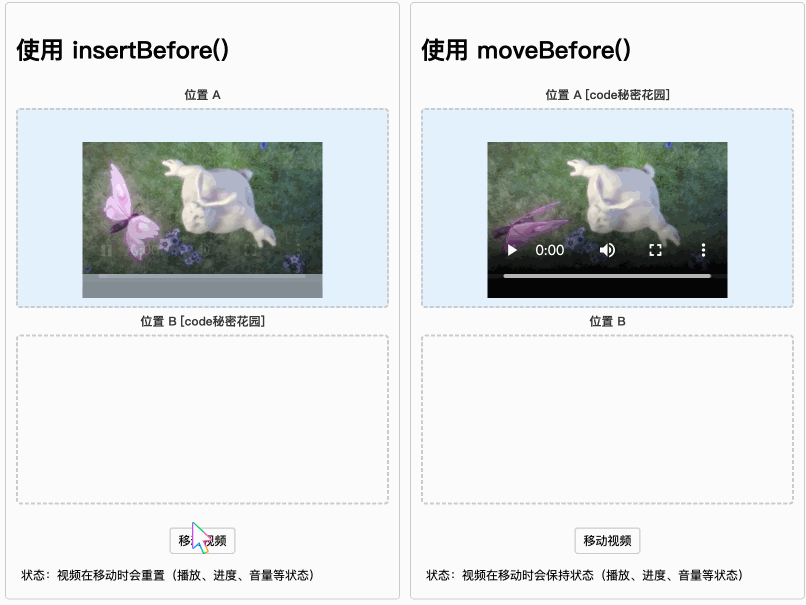

# insertBefore与moveBefore

## insertBefore

+ `父元素.insertBefore(待插入元素，那个元素之前)`

+ 内部操作顺序：先删除，然后删除

+ 注意：这个行为对普通元素无伤大雅，但对于以下场景却是灾难性的：

  + 正在播放的 `<video>` 或嵌入的 `<iframe>`
  + 处于全屏模式的元素
  + 执行中的 CSS 动画
  + 焦点状态的表单控件
  + 打开的模态对话框

## moveBefore

+ 只有 Chrome 133 及更高版本支持 moveBefore

  ```js
  // 新的原子移动操作
  parent.moveBefore(elementToMove, referenceNode);
  ```

+ 由于 moveBefore() 的算法不依赖于传统的插入和移除原语，因此不会触发移除步骤和插入步骤，从而能够默认保留大多数状态（例如不会拆解 `<iframe>` 或关闭对话框）
+ 当然，如果某些规范的插入 / 移除步骤覆盖需要在移动过程中执行某些操作

## insertBefore的问题 与 解决

+ 传统的 `insertBefore()` 会导致元素状态重置，因为它在底层执行的是删除然后插入的操作，这在处理 `<video>` 、 `<iframe>`、CSS 动画等元素时会引发问题
+ `moveBefore()` 提供了一种更优的方式，通过原子移动操作保持元素状态，避免重新加载或重置

+ `moveBefore()` 在性能上与 `insertBefore()` 差异不大，但能显著提升用户体验

## moveBefore() 与 insertBefore() 的对比

+ moveBefore() 与 insertBefore() 的对比

   与 insertBefore() 的对比.png>)

## 案例1：CSS 动画连续性

+ 传统的 DOM 移动操作会导致以下动画相关问题：

  + 动画帧重置
  + 过渡效果中断
  + 动画计时器重启
  + GPU 加速层重建

  ```css
  /* 复杂的动画定义 */
  .animation-box {
    animation: rotate 3s linear infinite,
              scale 2s ease-in-out infinite alternate;
    transform-origin: center;
    will-change: transform;
  }

  @keyframes rotate {
    from { transform: rotate(0deg) scale(1); }
    50% { transform: rotate(180deg) scale(1.2); }
    to { transform: rotate(360deg) scale(1); }
  }
  ```

  ```js
  // moveBefore 保持动画连续性
  function moveUsingMoveBefore() {
    const box = document.getElementById("animatedBox");
    targetContainer.moveBefore(box, null);
    // 动画保持完全连续，无需重置或重新计算状态
  }
  ```

  

+ 适用场景：

  + 复杂动画系统：粒子效果、3D 变换、交错动画序列；
  + 用户界面动效：拖拽排序动画、展开/折叠过渡、列表重排动画

## 案例2：视频播放

+ 在使用 `insertBefore` 移动视频元素时，我们会遇到以下问题：

  + 播放进度重置
  + 音量设置丢失
  + 播放状态（播放/暂停）重置
  + 播放速率重置
  + 字幕选择丢失

+ 这是因为 `insertBefore` 本质上是在 DOM 树中创建了一个新节点，原有节点的状态无法保持

+ 使用 moveBefore 优化

  ```js
  // 传统方式：需要手动保存和恢复状态
  function moveUsingInsertBefore() {
    const video = document.getElementById("video1");
    const currentTime = video.currentTime;
    const wasPlaying = !video.paused;
    const volume = video.volume;

    // 移动操作会重置所有状态
    targetContainer.insertBefore(video, referenceNode);

    // 需要手动恢复状态
    video.currentTime = currentTime;
    video.volume = volume;
    if (wasPlaying) video.play();
  }

  // 使用 moveBefore：一行代码解决所有问题
  function moveUsingMoveBefore() {
    const video = document.getElementById("video2");
    targetContainer.moveBefore(video, referenceNode);
    // 所有状态自动保持，无需额外代码
  }
  ```

  

+ 实际应用场景

  + 视频播放器布局调整：全屏/小窗切换、画中画模式切换、多视频布局重排；
  + 直播场景：主播和观众视频位置切换、多人连麦布局调整、课堂互动场景中的视频重排
