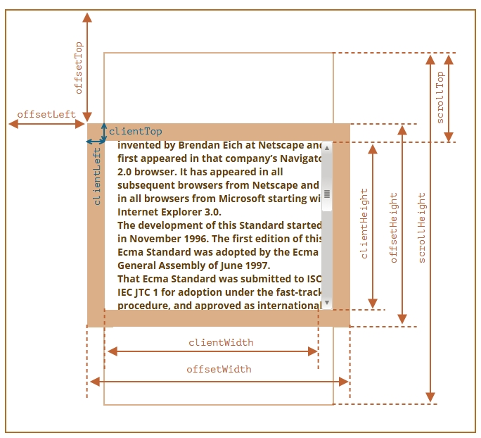

# 基础

## 概述

+ 示例

  ```html
  <div id="example">
    ...Text...
  </div>
  <style>
    #example {
      width: 300px;
      height: 200px;
      border: 25px solid #E8C48F;
      padding: 20px;
      overflow: auto;
    }
  </style>
  ```

  

## 总结

+ `offsetParent` —— 是最接近的 CSS 定位的祖先，或者是 td，th，table，body

+ `offsetLeft` / `offsetTop` —— 是相对于 offsetParent 的左上角边缘的坐标

+ `offsetWidth` / `offsetHeight` —— 元素的“外部” width/height，边框（border）尺寸计算在内

+ `clientLeft` / `clientTop` —— 从元素左上角外角到左上角内角的距离

  + 对于从左到右显示内容的操作系统来说，它们始终是左侧/顶部 `border` 的宽度
  + 而对于从右到左显示内容的操作系统来说，垂直滚动条在左边，所以 `clientLeft` 也包括滚动条的宽度

+ `clientWidth` / `clientHeight` —— 内容的 `width` / `height` ，包括 `padding` ，但不包括滚动条（scrollbar）

+ `scrollWidth` / `scrollHeight` —— 内容的 `width`  /`height` ，就像 `clientWidth` / `clientHeight` 一样，但还包括元素的滚动出的不可见的部分

+ `scrollLeft` / `scrollTop` —— 从元素的左上角开始，滚动出元素的上半部分的 `width` / `height`

  + 除了 `scrollLeft` / `scrollTop` 外，所有属性都是只读的
  + 如果我们修改 `scrollLeft` / `scrollTop` ，浏览器会滚动对应的元素

