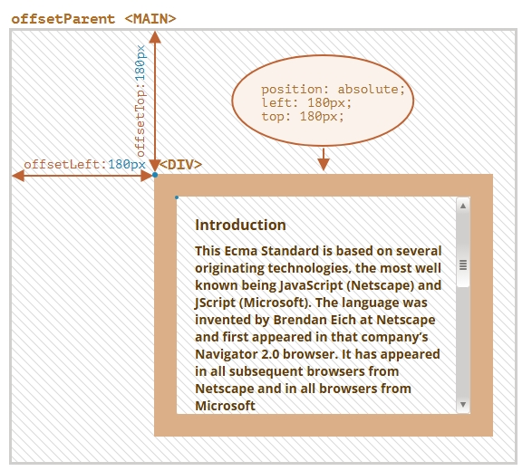

# offsetParent 、offsetLeft/Top

## offsetParent

+ offsetParent 是最接近的祖先（ancestor），在浏览器渲染期间，它被用于计算坐标
+ 最近的祖先为下列之一

  + CSS 定位的（ `position` 为 `absolute` 、 `relative` 、 `fixed` 或 `sticky` ）
  + 或 `<td>` ，`<th>` ，`<table>`
  + 或 `<body>`

+ 有以下几种情况下， `offsetParent` 的值为 `null`

  + 对于未显示的元素（`display:none` 或者不在文档中）
  + 对于 `<body>` 与 `<html>`
  + 对于带有 `position:fixed` 的元素

## offsetLeft/Top

+ 属性 `offsetLeft/offsetTop` 提供相对于 `offsetParent` 左上角的 `x/y` 坐标

+ 示例

  ```html
  <main style="position: relative" id="main">
    <article>
      <div id="example" style="position: absolute; left: 180px; top: 180px">...</div>
    </article>
  </main>
  <script>
    alert(example.offsetParent.id); // main
    alert(example.offsetLeft); // 180（注意：这是一个数字，不是字符串 "180px"）
    alert(example.offsetTop); // 180
  </script>
  ```

  
