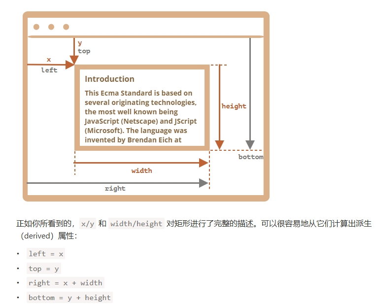

# 元素坐标：getBoundingClientRect

## 概述

+ 方法 `elem.getBoundingClientRect()` 返回最小矩形的窗口坐标，该矩形将 elem 作为内建 DOMRect 类的对象

+ 主要的 DOMRect 属性

  + x/y —— 矩形原点相对于窗口的 X/Y 坐标，
  + width/height —— 矩形的 width/height（可以为负）
  + top/bottom —— 顶部/底部矩形边缘的 Y 坐标 (派生（derived）属性)
  + left/right —— 左/右矩形边缘的 X 坐标 (派生（derived）属性)

  

+ 请注意：

  + 坐标可能是小数，例如 10.5。这是正常的，浏览器内部使用小数进行计算。在设置 style.left/top 时，我们不是必须对它们进行舍入
  + 坐标可能是负数。例如滚动页面，使 elem 现在位于窗口的上方，则 elem.getBoundingClientRect().top 为负数

## 为什么需要派生（derived）属性？如果有了 x/y，为什么还要还会存在 top/left？

