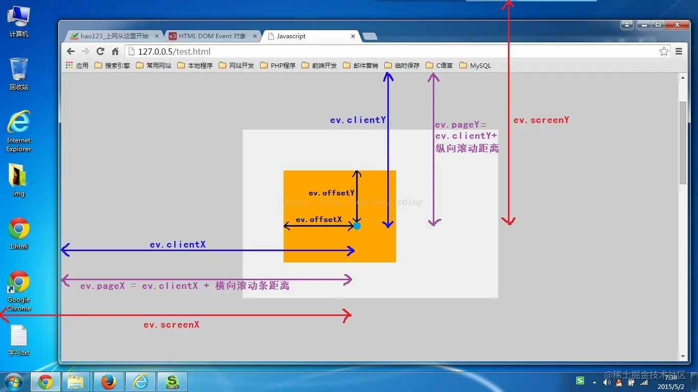
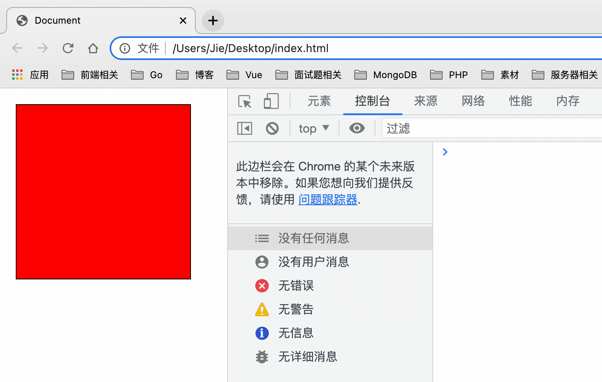

# 基础

## 分类

+ x、y：等同于 `clientX` 、 `clientY`

+ page：`pageX` 、 `pageY` 当前鼠标建立页面的横纵坐标

+ client：`clientX` 、 `clientY` 鼠标相对视口的位置

+ offset：`offsetX` 、 `offsetY` 鼠标相对事件源内边距的坐标

+ screen：`screenX` 、`screenY` 相对屏幕

+ movement：`movementX` 、 `movementY` 旨在鼠标移动事件中有效，相对于上一次鼠标的坐标偏移的距离

  + `movementX` 往右滑动是正，往左滑动是负

  

## clientX clientY

+ `clientX` 和 `clientY` ：鼠标相对于浏览器‌可视窗口‌（不包含滚动条）的坐标，原点为窗口左上角（0,0 ）

+ 相对于窗口 —— 类似于 position:fixed，从窗口的顶部/左侧边缘计算得出，即浏览器左上角坐标的
+ 不受页面滚动影响，仅反映当前窗口内的位置

  ```js
  var container = document.getElementById("container");
  container.onclick = function (ev) {
    var evt = ev || event;
    console.log(evt.clientX + ":" + evt.clientY);
  }
  ```

## pageX pageY

+ `pageX` 和 `pageY` 鼠标相对于‌整个页面‌（包含滚动部分）的坐标，原点为页面左上角

+ 相对于文档 —— 与文档根（document root）中的 `position:absolute` 类似，从文档的顶部/左侧边缘计算得出
+ 包含滚动偏移，反映鼠标在页面整体中的位置
+ 页面向右滚动200px后，点击窗口内100px处，pageX为300

  ```js
  pageX = clientX + 滚动偏移量
  ```

  ```js
  var container = document.getElementById("container");
  container.onclick = function (ev) {
    var evt = ev || event;
    console.log("pageX:", evt.pageX);
    console.log("pageY:", evt.pageY);
    console.log("clientX:", evt.clientX);
    console.log("clientY:", evt.clientY);
  }
  ```

  
  

## screenX screenY

+ `screenX` 和 `screenY` 属性 鼠标相对于‌屏幕‌的坐标，原点为屏幕左上角

+ 与浏览器窗口和页面滚动无关，适用于全屏定位

  ```js
  screenX = clientX + 浏览器窗口位置
  ```

  ```js
  var container = document.getElementById("container");
  container.onclick = function (ev) {
    var evt = ev || event;
    console.log(evt.screenX + ":" + evt.screenY);
  }
  ```

## offsetX offsetY

+ `offsetX` 和 `offsetY` 鼠标相对于‌触发事件的元素内边距‌（padding edge）的坐标

+ 用于元素内部定位，如点击按钮时计算偏移

  ```js
  var container = document.getElementById("container");
  container.onclick = function (ev) {
    var evt = ev || event;
    console.log("offsetX:", evt.offsetX);
    console.log("offsetY:", evt.offsetY);
  }
  ```

## 当文档滚动了

+ pageY —— 元素在文档中的相对坐标保持不变，从文档顶部（现在已滚动出去）开始计算
+ clientY —— 窗口相对坐标确实发生了变化（箭头变短了），因为同一个点越来越靠近窗口顶部
