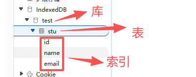

# 核心概念

## 基本模式

+ 步骤1：打开数据库
+ 步骤2：在数据库中创建一个对象存储（object store）
+ 步骤3：启动事务，并发送一个请求来执行一些数据库操作，如添加或获取数据等
+ 步骤4：通过监听正确类型的 DOM 事件以等待操作完成
+ 步骤5：对结果进行一些操作（可以在 request 对象中找到）

## 核心概念

+ 数据库：IDBDatabase 对象

+ 对象仓库：IDBObjectStore 对象

+ 索引： IDBIndex 对象

+ 事务： IDBTransaction 对象

+ 操作请求：IDBRequest 对象

+ 指针： IDBCursor 对象

+ 主键集合：IDBKeyRange 对象

  + 主键是默认建立索引的属性，可以取当前层级的某个属性，也可以指定下一层对象的属性，还可以是一个递增的整数

  

## 数据库

+ 数据库是一系列相关数据的容器
+ 每个域名（严格的说，是协议 + 域名 + 端口）都可以新建任意多个数据库

+ IndexedDB 数据库有版本的概念
+ 同一个时刻，只能有一个版本的数据库存在
+ 如果要修改数据库结构（新增或删除表、索引或者主键），只能通过升级数据库版本完成

## 对象仓库

+ 每个数据库包含若干个对象仓库（object store）
+ 它类似于关系型数据库的表格

## 数据记录

+ 对象仓库保存的是数据记录。每条记录类似于关系型数据库的行，但是只有主键和数据体两部分
+ 主键用来建立默认的索引，必须是不同的，否则会报错
+ 主键可以是数据记录里面的一个属性，也可以指定为一个递增的整数编号

  ```js
  // id属性可以当作主键
  { id: 1, text: 'foo' }
  ```

+ 数据体可以是任意数据类型，不限于对象

## 索引

+ 为了加速数据的检索，可以在对象仓库里面，为不同的属性建立索引

  

+ 在关系型数据库当中也有索引的概念，我们可以给对应的表字段添加索引，以便加快查找速率

  + 在 IndexedDB 中同样有索引，我们可以在创建 store 的时候同时创建索引，在后续对 store 进行查询的时候即可通过索引来筛选，给某个字段添加索引后，在后续插入数据的过成功，索引字段便不能为空

## 事务

+ 数据记录的读写和删改，都要通过事务完成
+ 事务对象提供error、abort和complete三个事件，用来监听操作结果

## 指针（游标）

+ 游标是 IndexedDB 数据库新的概念，大家可以把游标想象为一个指针
+ 比如我们要查询满足某一条件的所有数据时，就需要用到游标，我们让游标一行一行的往下走，游标走到的地方便会返回这一行数据，此时我们便可对此行数据进行判断，是否满足条件
