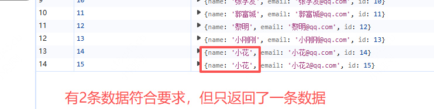

## 读取数据之索引

## 通过索引查询数据

+ 索引名称即我们创建仓库的时候创建的索引名称，也就是键值对中的键，最终会查询出所有满足我们传入函数索引值的数据

  ```js
  /**
   * 通过索引读取数据
   * @param {object} db 数据库实例
   * @param {string} storeName 仓库名称
   * @param {string} indexName 索引名称
   * @param {string} indexValue 索引值
   */
  function getDataByIndex(db, storeName, indexName, indexValue) {
    return new Promise((resolve, reject) => {
      const store = db.transaction(storeName, "readwrite").objectStore(storeName);
      const request = store.index(indexName).get(indexValue);

      request.onerror = function (e) {
        console.log("事务失败");
        reject(e);
      };
      request.onsuccess = function (e) {
        const result = e.target.result;
        console.log("索引查询结果：", result);
        resolve(result);
      };
    });
  }

  getDataByIndex(dbVal!, "stu", "name", "小花")
    .then(res => {
      console.log(res);
    })
    .catch(err => {
      console.error(err);
    });
  ```

+ 缺点：只能找出一条符合要求的第一条数据

  
