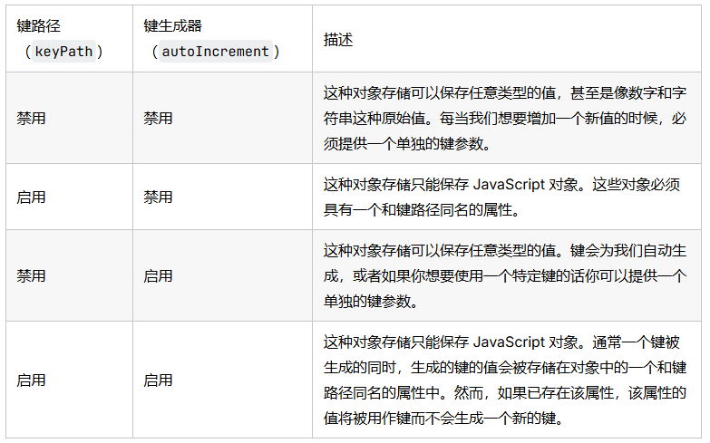

# 键

## 概述

+ 键的提供可以有几种不同的方法，这取决于对象存储是使用键路径 还是键生成器

  

## 自动生成主键

+ 如果数据记录里面没有合适作为主键的属性，那么可以让 IndexedDB 自动生成主键

  ```js
  var objectStore = db.createObjectStore(
    'person',

    // 主键为一个递增的整数
    { autoIncrement: true }
  );
  ```

