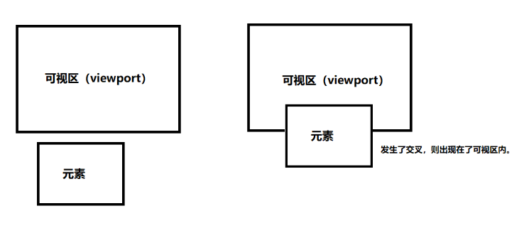

# IntersectionObserver

## 语法

+ `var observer = new IntersectionObserver(callback[, options]);`

+ 参数

  + callback 当元素可见比例超过指定阈值后，会调用一个回调函数，此回调函数接受两个参数：

    + entries 一个IntersectionObserverEntry对象的数组，每个被触发的阈值，都或多或少与指定阈值有偏差

    + observer 被调用的IntersectionObserver实例

  + options [可选] 一个可以用来配置 observer 实例的对象。如果options未指定，observer 实例默认使用文档视口作为 root，并且没有 margin，阈值为 0%（意味着即使一像素的改变都会触发回调函数）。你可以指定以下配置：

    + `root` 监听元素的祖先元素Element对象，其边界盒将被视作视口。目标在根的可见区域的任何不可见部分都会被视为不可见

    + `rootMargin` 一个在计算交叉值时添加至根的边界盒 (bounding_box) 中的一组偏移量，类型为字符串 (string) ，可以有效的缩小或扩大根的判定范围从而满足计算需要

      + 语法大致和 CSS 中的margin 属性等同; 可以参考 intersection root 和 root margin 来深入了解 margin 的工作原理及其语法
      + 默认值是"0px 0px 0px 0px"

    + `threshold` 规定了一个监听目标与边界盒交叉区域的比例值，可以是一个具体的数值或是一组 0.0 到 1.0 之间的数组

      + 若指定值为 0.0，则意味着监听元素即使与根有 1 像素交叉，此元素也会被视为可见
      + 如果threshold属性是0.5，当元素进入视口50%时，触发回调函数
      + 若指定值为 1.0，则意味着整个元素都在可见范围内时才算可见。可以参考阈值来深入了解阈值是如何使用的
      + 如果值为 `[0.3, 0.6]`，则当元素进入30％和60％是触发回调函数
      + 阈值的默认值为 0.0

      ```js
      new IntersectionObserver(
        entries => {/* … */},
        {
          threshold: [0, 0.25, 0.5, 0.75, 1] // 当目标元素 0%、25%、50%、75%、100% 可见时，会触发回调函数
        }
      );
      ```

+ 返回值 一个可以使用规定阈值监听目标元素可见部分与root交叉状况的新的IntersectionObserver 实例。调用自身的observe() 方法开始使用规定的阈值监听指定目标

  

  

  ```js
  // 开始观察
  observer.observe(document.getElementById('example'));

  // 停止观察
  observer.unobserve(element);

  // 关闭观察器
  observer.disconnect();
  ```

  ```js
  // 观察多个节点，就要多次调用
  observer.observe(elementA);
  observer.observe(elementB);
  ```

## observe 的 callback 参数

+ 目标元素的可见性变化时，就会调用观察器的回调函数callback

+ callback会触发两次
+ 一次是目标元素刚刚进入视口（开始可见），另一次是完全离开视口（开始不可见）

  ```js
  var observer = new IntersectionObserver(
    (entries, observer) => {
      console.log(entries); // 数组
    }
  );
  ```

+ entries -> item

  + time：可见性发生变化的时间，是一个高精度时间戳，单位为毫秒
  + target：被观察的目标元素，是一个 DOM 节点对象
  + rootBounds：容器元素的矩形区域的信息，`getBoundingClientRect()` 方法的返回值，如果没有容器元素（即直接相对于视口滚动），则返回 `null`
  + boundingClientRect：目标元素的矩形区域的信息
  + intersectionRect：目标元素与视口（或容器元素）的交叉区域的信息
  + intersectionRatio：目标元素的可见比例，即 `intersectionRect` 占 `boundingClientRect` 的比例，完全可见时为1，完全不可见时小于等于0

  

  ```js
  {
    time: 3893.92,
    rootBounds: ClientRect {
      bottom: 920,
      height: 1024,
      left: 0,
      right: 1024,
      top: 0,
      width: 920
    },
    boundingClientRect: ClientRect {
      // ...
    },
    intersectionRect: ClientRect {
      // ...
    },
    intersectionRatio: 0.54,
    target: element
  }
  ```

## 示例

+ 示例

  ```html
  <style>
    body {
      margin: 0;
    }

    .content {
      width: 100px;
      height: 200px;
      border: 2px solid #fac;
      overflow: scroll;
    }
    .content div {
      width: 50px;
      height: 100px;
      background-color: #cfa;
    }
    ::-webkit-scrollbar {
      display: none;
    }
  </style>

  <div class="content">
    <div>1</div>
    <div>2</div>
    <div>3</div>
    <div>4</div>
    <div class="box">box</div>
  </div>

  <script>
    const content = document.querySelector(".content");
    const box = document.querySelector(".box");
    // 交叉观察者
    // Intersection Observer
    const ob = new IntersectionObserver(
      (entries) => {
        console.log(entries);
        console.log("交叉情况发生变化");
        entries.forEach((entry) => {
          if (entry.isIntersecting) {
            ob.unobserve(entry.target);
            console.log("满足交叉条件");
          } else {
            console.log("不满足交叉条件");
          }
        });
      },
      {
        root: content,
        rootMargin: '20px',
        threshold: 1,
      }
    );

    ob.observe(box);
  </script>
  ```
