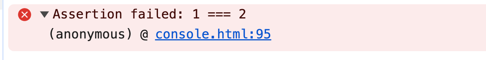

# console.assert()

## 概述

+ `console.assert()` 用于在特定条件不满足时输出错误信息到开发者工具的控制台
+ 它接受一个表达式作为第一个参数，如果该表达式的值为 `false` ，则会将第二个参数作为错误信息输出到控制台中

+ console.assert(expression, message);

  + expression：要进行断言的表达式
  + message：当表达式为 `false` 时要输出的错误信息

  ```js
  // 只有在 第一个参数 为 false 的时候
  // 才会输出 ""1 === 2"
  console.assert(1 === 2, "1 === 2");
  ```

  
