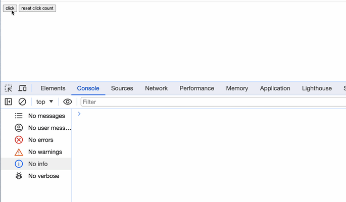

# console.count()

## 概述

+ console.count() 用于计算和记录特定标识符被调用的次数，并将结果输出到开发者工具的控制台中。每次调用 console.count() 并提供相同的标识符时，计数器都会递增并显示在控制台中

+ 使用 console.count() 时，你可以提供一个可选的标识符作为参数，用于标识计数器。如果没有提供标识符，计数器将默认为一个空字符串

  ```js
  console.count(); // 输出：default: 1
  console.count(); // 输出：default: 2
  console.count('myCounter'); // 输出：myCounter: 1
  console.count('myCounter'); // 输出：myCounter: 2
  console.count(); // 输出：default: 3
  ```

  

## count示例

+ code

  ```js
  <button id="clickBtn">click</button>
  <script>
    document.getElementById("clickBtn")
    .addEventListener("click", () => {
      console.count("click");
    });
  </script>
  ```

## console.countReset()

+ console.countReset() 用于重置指定标识符的计数器
+ 这个方法允许你在开发者工具的控制台中重新开始某个特定标识符的计数

  ```js
  <button id="clickBtn">click</button>
  <button id="resetClickBtn">reset click count</button>
  <script>
    document.getElementById("clickBtn")
      .addEventListener("click", () => {
        console.count("click");
      });

    document.getElementById("resetClickBtn")
      .addEventListener("click", () => {
        console.countReset("click");
      });
  </script>
  ```

  
