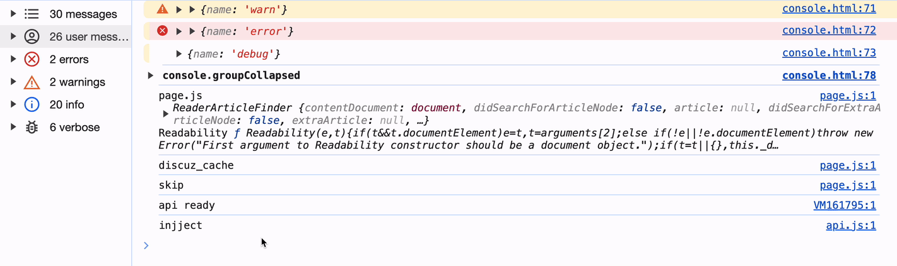

# clear 保持控制台清洁

## console.clear()

+ 如果您在开发过程中频繁记录，您的控制台可能会很快变得混乱
+ 当您不再需要旧日志时，使用 `console.clear()` 清除控制台，而不是手动清除它或筛选无休止的日志

  ```js
  console.clear();
  ```

  

+ 优点：它可以帮助您专注于最新的日志和数据，从而提高调试过程的效率
