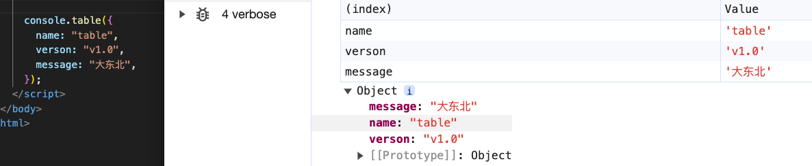

# table

## table()

+ 对于某些复合类型的数据，`console.table` 方法可以将其转为表格显示

  ```js
  var languages = [
    { name: "JavaScript", fileExtension: ".js" },
    { name: "TypeScript", fileExtension: ".ts" },
    { name: "CoffeeScript", fileExtension: ".coffee" }
  ];

  console.table(languages);
  ```

  

## 对象时空固定

+ 对象时空固定

  ```js
  let a = { b: { c: 1 } }
  a.b.c = 2
  console.log(a) // 打印 a 为 3
  a.b.c = 3
  ```

  ```js
  // 解决办法
  let a = { b: { c: 1 } }
  a.b.c = 2
  console.table(a)
  a.b.c = 3
  ```
