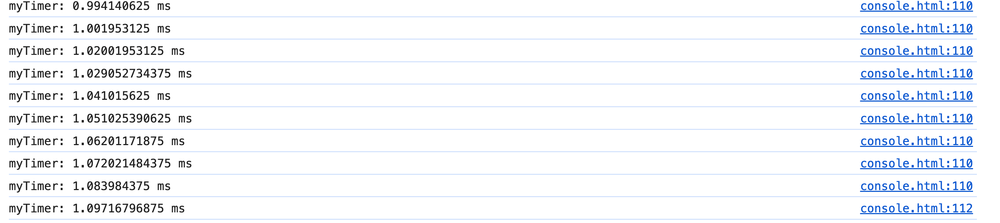

# time 、 timeEnd

## time()，timeEnd()

+ 这两个方法用于计时，可以算出一个操作所花费的准确时间

  ```js
  console.time("myTimer");
  // 执行需要计时的代码，比如一个循环或者一段复杂的函数
  let sum = 0;
  for (let i = 0; i < 100; i++) {
    sum += i;
    console.timeLog("myTimer");
  }
  console.timeEnd("myTimer"); // 输出执行时间，单位为毫秒
  console.timeStamp();
  ```

  
  

+ `time` 方法表示计时开始，`timeEnd` 方法表示计时结束

+ 它们的参数是计时器的名称

+ 调用 `timeEnd` 方法之后，`console` 窗口会显示“计时器名称: 所耗费的时间”
