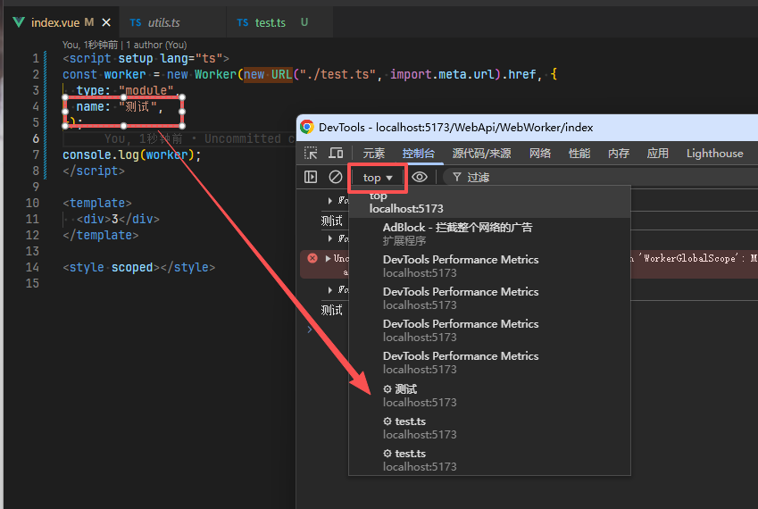

# 构造函数

## 概述

+ Worker() 构造函数创建一个 Worker 对象，该对象执行指定的 URL 脚本
+ 这个脚本必须遵守 同源策略

## API

+ `const myWorker = new Worker(aURL, options);`

  + 参数

    + aURL  是一个DOMString 表示 worker 将执行的脚本的 URL。它必须遵守同源策略

    + options 包含可在创建对象实例时设置的选项属性的对象。可用属性如下：

      + type：用以指定 worker 类型的 DOMString 值

        + `classic` 默认值
        + `module` （支持 `export` 导出）

      + credentials：用以指定 worker 凭证的 DOMString 值。如果未指定，或者 type 是 classic，将使用默认值 omit (不要求凭证)

        + `omit` 不携带
        + `same-origin` 携带同源
        + `include` 携带所有

      + *name：*在 DedicatedWorkerGlobalScope 的情况下，用来表示 worker 的 scope 的一个 DOMString 值，主要用于调试目的

        

  + 返回值 创建的 worker

  ```js
  // vite 中
  const worker = new Worker(new URL("./test.ts", import.meta.url).href, { type: "module" });
  ```
