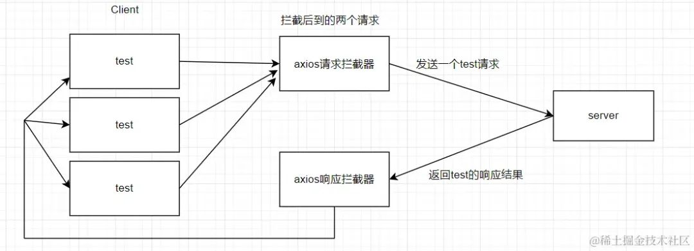

# 前端接口防止重复请求实现方案

## 实现方案

1. 一个请求包含的内容不外乎就是请求方法，地址，参数以及请求发出的页面hash。那我们是不是就可以根据这几个数据把这个请求生成一个key来作为这个请求的标识

  ```js
  // 根据请求生成对应的key
  function generateReqKey(config, hash) {
    const { method, url, params, data } = config;
    return [method, url, JSON.stringify(params), JSON.stringify(data), hash].join("&");
  }
  ```

2. 有了请求的key，我们就可以在请求拦截器中把每次发起的请求给收集起来，后续如果有相同请求进来，那都去这个集合中去比对，如果已经存在了，说明就是一个重复的请求，对于相同的请求我们先给它挂起，等到最先发出去的请求拿到结果回来之后，把成功或失败的结果共享给后面到来的相同请求

  

+ 注意点

  + 我们在拿到响应结果后，返回给之前我们挂起的请求时，我们要用到发布订阅模式（日常在面试题中看到，这次终于让我给用上了(^▽^)）+ 对于挂起的请求，我们需要将它拦截，不能让它执行正常的请求逻辑，所以一定要在请求拦截器中通过 `return Promise.reject()` 来直接中断请求，并做一些特殊的标记，以便于在响应拦截器中进行特殊处理

## 完整代码

+ code

  ```js
  import axios from "axios"

  let instance = axios.create({
    baseURL: "/api/"
  })

  // 发布订阅
  class EventEmitter {
    constructor() {
      this.event = {}
    }
    on(type, cbres, cbrej) {
      if (!this.event[type]) {
        this.event[type] = [[cbres, cbrej]]
      } else {
        this.event[type].push([cbres, cbrej])
      }
    }

    emit(type, res, ansType) {
      if (!this.event[type]) return
      else {
        this.event[type].forEach(cbArr => {
          if(ansType === 'resolve') {
            cbArr[0](res)
          }else{
            cbArr[1](res)
          }
        });
      }
    }
  }


  // 根据请求生成对应的key
  function generateReqKey(config, hash) {
    const { method, url, params, data } = config;
    return [method, url, JSON.stringify(params), JSON.stringify(data), hash].join("&");
  }

  // 如果含有FormData类型的数据，我们就直接放行不再关注这个请求就是了
  function isFileUploadApi(config) {
    return Object.prototype.toString.call(config.data) === "[object FormData]"
  }

  // 存储已发送但未响应的请求
  const pendingRequest = new Set();
  // 发布订阅容器
  const ev = new EventEmitter()

  // 添加请求拦截器
  instance.interceptors.request.use(async (config) => {
    let hash = location.hash
    // 生成请求Key
    let reqKey = generateReqKey(config, hash)

    if(!isFileUploadApi(config) && pendingRequest.has(reqKey)) {
      // 如果是相同请求,在这里将请求挂起，通过发布订阅来为该请求返回结果
      // 这里需注意，拿到结果后，无论成功与否，都需要return Promise.reject()来中断这次请求，否则请求会正常发送至服务器
      let res = null
      try {
        // 接口成功响应
        res = await new Promise((resolve, reject) => {
          ev.on(reqKey, resolve, reject)
        })
        return Promise.reject({
          type: 'limiteResSuccess',
          val: res
        })
      }catch(limitFunErr) {
        // 接口报错
        return Promise.reject({
          type: 'limiteResError',
          val: limitFunErr
        })
      }
    }else{
      // 将请求的key保存在config
      config.pendKey = reqKey
      pendingRequest.add(reqKey)
    }

    return config;
  }, function (error) {
    return Promise.reject(error);
  });

  // 添加响应拦截器
  instance.interceptors.response.use(function (response) {
    // 将拿到的结果发布给其他相同的接口
    handleSuccessResponse_limit(response)
    return response;
  }, function (error) {
    return handleErrorResponse_limit(error)
  });

  // 接口响应成功
  function handleSuccessResponse_limit(response) {
    const reqKey = response.config.pendKey
    if(pendingRequest.has(reqKey)) {
      let x = null
      try {
        x = JSON.parse(JSON.stringify(response))
      }catch(e) {
        x = response
      }
      pendingRequest.delete(reqKey)
      ev.emit(reqKey, x, 'resolve')
      delete ev.event[reqKey]
    }
  }

  // 接口走失败响应
  function handleErrorResponse_limit(error) {
    if(error.type && error.type === 'limiteResSuccess') {
      return Promise.resolve(error.val)
    }else if(error.type && error.type === 'limiteResError') {
      return Promise.reject(error.val);
    }else{
      const reqKey = error.config.pendKey
      if(pendingRequest.has(reqKey)) {
        let x = null
        try {
          x = JSON.parse(JSON.stringify(error))
        }catch(e) {
          x = error
        }
        pendingRequest.delete(reqKey)
        ev.emit(reqKey, x, 'reject')
        delete ev.event[reqKey]
      }
    }
    return Promise.reject(error);
  }

  export default instance;
  ```
