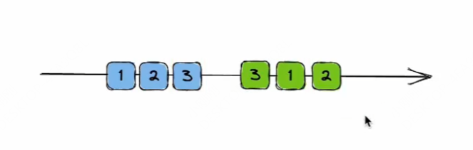
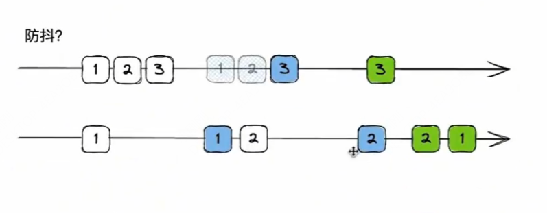
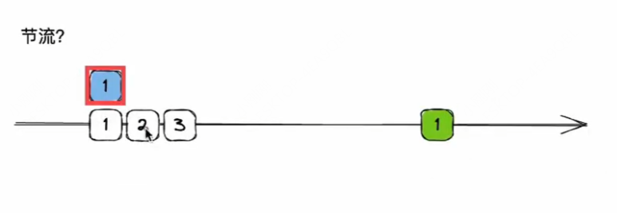
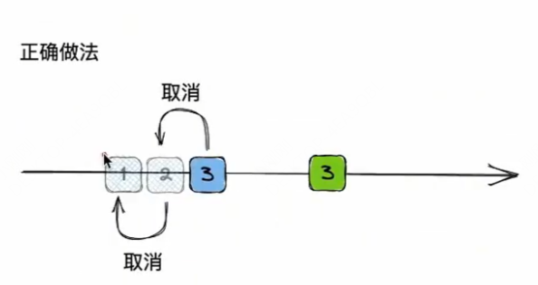

# 请求乱序

## 请求乱序

+ 请求乱序.

  ```
  请求顺序是 123

  因为网络原因导致返回结果可能是 312
  ```

  

## 解决办法

+ 方式1：防抖？ 不能解决

  

+ 方式2：节流？ 不能解决

  

+ 方式3 取消之前的发送 √

  ```js
  let controller;

  const asyncApi = () => {
    // 存在则取消上一次请求
    controller && controller.abort();

    controller = new AbortController();

    await fetch("请求地址", {
      signal: controller.signal
    }).then(res => res.join()).then(res => {
      // 请求结果
    });
  }

  // 取消请求
  // controller.abort();
  ```

  
