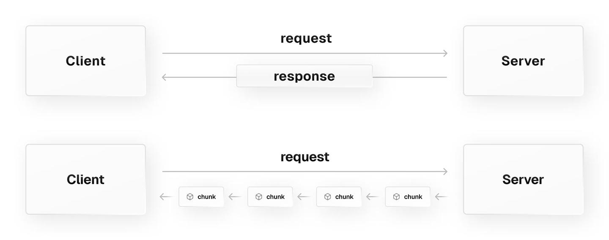

# Stream API

## 概述

+ Stream API 允许 JavaScript 以编程方式访问从网络接收的数据流，并且允许开发人员根据需要处理它们

  

## 概念和用法

+ 流会将你想要从网络接受的资源分成一个个小的分块，然后按位处理它。这正是浏览器在接收用于显示 web 页面的资源时做的事情——视频缓冲区和更多的内容可以逐渐播放，有时候随着内容的加载，你可以看到图像逐渐地显示

+ 但曾经这些对于 JavaScript 是不可用的。以前，如果我们想要处理某种资源（如视频、文本文件等），我们必须下载完整的文件，等待它反序列化成适当的格式，然后在完整地接收到所有的内容后再进行处理

+ 随着流在 JavaScript 中的使用，一切发生了改变——只要原始数据在客户端可用，你就可以使用 JavaScript 按位处理它，而不再需要缓冲区、字符串或 blob

## 可读流

+ ReadableStream

  + 表示数据的可读流。用于处理 Fetch API 返回的响应，或者开发者自定义的流（例如通过 ReadableStream() 构造的流）

+ ReadableStreamDefaultReader

  + 表示默认 reader，用于读取来自网络的数据流（例如 fetch 请求）。

+ ReadableStreamDefaultController

  + 表示一个 controller，用于控制 ReadableStream 的状态及内部队列。默认的 controller 用于处理非字节流。

## 可写流

+ WritableStream

  + 为将流写入目的地（称为接收器）的过程，提供了一个标准抽象。内置了背压和队列机制。

+ WritableStreamDefaultWriter

  + 表示默认 writer，用于将分块的数据写入可写流中。

+ WritableStreamDefaultController

  + 表示一个 controller，用于控制 WritableStream 的状态。当创建一个 WritableStream 时，对应的 WritableStreamDefaultController 实例会被提供给底层的接收器供其操作。

## 转换流

+ TransformStream

  + 表示一组可转化的数据

+ TransformStreamDefaultController

  + 提供操作和转换流关联的 ReadableStream 和 WritableStream 的方法。

